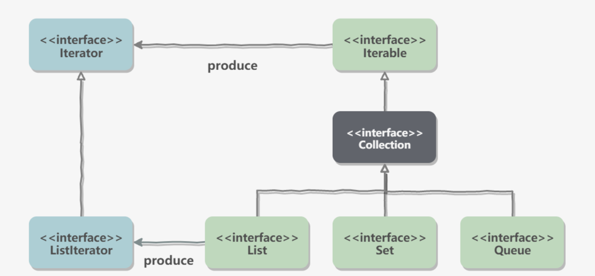

## 概览

容器主要包括**Collection**和**Map**两种。

- **Collection**：存储对象的集合。
- **Map**：存储键值的映射表。

### Collection


#### Set

- **TreeSet：**基于**红黑树**实现，支持有序性操作，例如根据一个范围查找元素的操作。但是查找效率不如 HashSet，HashSet 查找的时间复杂度为 O(1)，TreeSet 则为 O(logN)。

- **HashSet：**基于哈希表实现，支持快速查找，但不支持有序性操作。并且失去了元素的插入顺序信息，也就是说使用 Iterator 遍历 HashSet 得到的结果是不确定的。

  > HashSet继承自HashMap，如HashMap一样底层数据结构是哈希表，所以查找的时间复杂度可达到O(1)。

- **LinkedHashSet：**具有 HashSet 的查找效率，并且内部使用**双向链表**维护元素的插入顺序。

  > LinkedHashSet在HashMap的基础上，在每项链表之间提供了一对指针分别指向该节点插入顺序的上一个元素和下一个元素。
  >
  > 
  >
  > 如上图所示。


#### List

- **ArrayList：**基于动态数组实现，支持**随机访问**。

- **Vector：**和 ArrayList 类似，但它是线程安全的。

  > 在实际使用时，已经很少使用Vector，一般倾向与选择ArrayList。因为在Vector中，只要涉及关键性操作（如 `get(),size()` 等），方法前面都加了synchronized关键字，各种加锁和释放锁的过程都会占用开销，所以Vector在单线程下效率比ArrayList差很多。

- **LinkedList：**基于双向链表实现，只能顺序访问，但是可以快速地在链表中间**插入和删除**元素。不仅如此，LinkedList 还可以用作栈、队列和双向队列。

  

#### Queue

- **LinkedList：**可以用它来实现**双向队列**。
- **PriorityQueue：**基于**堆结构**实现，可以用它来实现优先队列。


### Map


- **TreeMap：**基于**红黑树**实现。
- **HashMap：**基于**哈希表**实现。
- **HashTable：**和 HashMap 类似，但它是线程安全的，这意味着同一时刻多个线程同时写入 HashTable 不会导致数据不一致。它是遗留类，不应该去使用它，而是使用 ConcurrentHashMap 来支持线程安全，ConcurrentHashMap 的效率会更高，因为 ConcurrentHashMap 引入了分段锁。
- **LinkedHashMap：**使用双向链表来维护元素的顺序，顺序为插入顺序或者最近最少使用（LRU）顺序。


## 容器的设计模式

### 迭代器模式



Collection 继承了 Iterable 接口，其中的 iterator() 方法能够产生一个 Iterator 对象，通过这个对象就可以迭代遍历 Collection 中的元素。

从 JDK 1.8 之后可以使用 foreach 方法来遍历实现了 Iterable 接口的聚合对象。

看所有可迭代类型的父接口Iterable中，foreach的定义如下：

```

default void forEach(Consumer<? super T> action) {//接受一个Consumer对象，是一个消费者类型的函数式接口。
    Objects.requireNonNull(action);
    for (T t : this) {
        action.accept(t);
    }
}
```

例子：

```
list.forEach(System.out::println);//结合上面的源码，t是System.out::println的入参
```

 	

### 适配器模式

java.util.Arrays的asList() 方法可以把数组类型转换为 List 类型。

> **Arrays**是一个工具类，另外还有一个常用工具类：**Collections**。

```java
@SafeVarargs
public static <T> List<T> asList(T... a)
```

 asList() 的参数为泛型的变长参数，不能使用基本类型数组作为参数，只能使用相应的包装类型数组。

```java
Integer[] arr = {1, 2, 3};
List list = Arrays.asList(arr);
```

也可以使用以下方式调用 asList()：

```
List list = Arrays.asList(1, 2, 3);
```


## 源码分析

以下源码分析基于JDK1.8。

### ArrayList

#### 概述

因为 ArrayList 是基于数组实现的，所以支持快速随机访问。RandomAccess 接口标识着该类支持快速随机访问。

```java
public class ArrayList<E> extends AbstractList<E>
        implements List<E>, RandomAccess, Cloneable, java.io.Serializable
```

ArrayList的默认大小为10，这里并不是说在new一个ArrayList实例时就会分配一个大小为10的arraylist实例给我们，ArrayList的大小与构造函数选择有关。

```java

/**
 * Default initial capacity.
 */
private static final int DEFAULT_CAPACITY = 10;//默认大小，其实是在默认构造下第一次括容的大小

/**
 * Shared empty array instance used for empty instances.
 */
private static final Object[] EMPTY_ELEMENTDATA = {};//自定义Arraylist大小为0时 elementData的指向

/**
 * Shared empty array instance used for default sized empty instances. We
 * distinguish this from EMPTY_ELEMENTDATA to know how much to inflate when
 * first element is added.
 */
private static final Object[] DEFAULTCAPACITY_EMPTY_ELEMENTDATA = {}; //默认构造下elementData的指向，可以看到，默认构造下ArrayList大小为0

/**
 * The array buffer into which the elements of the ArrayList are stored.
 * The capacity of the ArrayList is the length of this array buffer. Any
 * empty ArrayList with elementData == DEFAULTCAPACITY_EMPTY_ELEMENTDATA
 * will be expanded to DEFAULT_CAPACITY when the first element is added.
 */
transient Object[] elementData; // non-private to simplify nested class access
```

**ArrayList的三个构造函数：**

```java
/**接受一个int类型的参数，
 *如果initialCapacity>0,则将elementData引用指向initialCapacity大小的数组。
 *如果initialCapacity=0,则将elementData引用指向EMPTY_ELEMENTDATA(这是个空数组)
 *如果initialCapacity<0,报异常
 */
public ArrayList(int initialCapacity) {
    if (initialCapacity > 0) {
        this.elementData = new Object[initialCapacity];
    } else if (initialCapacity == 0) {
        this.elementData = EMPTY_ELEMENTDATA;
    } else {
        throw new IllegalArgumentException("Illegal Capacity: "+
                                           initialCapacity);
    }
}


/**
 *无参构造函数，将elementData引用指向DEFAULTCAPACITY_EMPTY_ELEMENTDATA(空数组)
 */
public ArrayList() {
    this.elementData = DEFAULTCAPACITY_EMPTY_ELEMENTDATA;
}

/**
 *接受一个容器类作为参数，把容器转换成数组复制到新的ArrayList中。
 */
public ArrayList(Collection<? extends E> c) {
    elementData = c.toArray();
    if ((size = elementData.length) != 0) {
        // c.toArray might (incorrectly) not return Object[] (see 6260652)
        if (elementData.getClass() != Object[].class)
            elementData = Arrays.copyOf(elementData, size, Object[].class);
    } else {
        // replace with empty array.
        this.elementData = EMPTY_ELEMENTDATA;
    }
}
```


#### 扩容

添加元素时使用 ensureCapacityInternal() 方法来保证容量足够，如果不够时，需要使用 grow() 方法进行扩容，新容量的大小为 `oldCapacity + (oldCapacity >> 1)`，即 oldCapacity+oldCapacity/2。其中 oldCapacity >> 1 需要取整，所以新容量大约是旧容量的 1.5 倍左右。（oldCapacity 为偶数就是 1.5 倍，为奇数就是 1.5 倍-0.5）

```java
    public boolean add(E e) {
        ensureCapacityInternal(size + 1);  // Increments modCount!!
        elementData[size++] = e;
        return true;
    }


    private void ensureCapacityInternal(int minCapacity) {
        ensureExplicitCapacity(calculateCapacity(elementData, minCapacity));
    }

//如果使用默认构造，则返回10和minCapacity中较大者；如果使用其他两个构造函数，则直接返回minCapacity
//这个函数在使用默认构造的情况下才会发挥真正的作用，由于默认构造的elementData长度为0，grow()会在第一次往ArrayList插入时把elementData扩容到长度为10
   private static int calculateCapacity(Object[] elementData, int minCapacity) {
        if (elementData == DEFAULTCAPACITY_EMPTY_ELEMENTDATA) {
            return Math.max(DEFAULT_CAPACITY, minCapacity);
        }
        return minCapacity;
    }


    private void ensureExplicitCapacity(int minCapacity) {
        modCount++;

        // overflow-conscious code
        if (minCapacity - elementData.length > 0)
            grow(minCapacity);
    }


    private void grow(int minCapacity) {
        // overflow-conscious code
        int oldCapacity = elementData.length;
        int newCapacity = oldCapacity + (oldCapacity >> 1);
        if (newCapacity - minCapacity < 0)
            newCapacity = minCapacity;
        if (newCapacity - MAX_ARRAY_SIZE > 0)
            newCapacity = hugeCapacity(minCapacity);
        // minCapacity is usually close to size, so this is a win:
        elementData = Arrays.copyOf(elementData, newCapacity);
    }
```

扩容操作需要调用 `Arrays.copyOf()` 把原数组整个复制到新数组中，这个操作代价很高，因此最好在创建 ArrayList 对象时就指定大概的容量大小，减少扩容操作的次数。


#### 删除元素

需要调用 System.arraycopy() 将 index+1 后面的元素都复制到 index 位置上，该操作的时间复杂度为 O(N)，可以看到 ArrayList 删除元素的代价是非常高的。

```java
public E remove(int index) {
        rangeCheck(index);

        modCount++;
        E oldValue = elementData(index);

        int numMoved = size - index - 1;
        if (numMoved > 0)
            System.arraycopy(elementData, index+1, elementData, index,
                             numMoved);
        elementData[--size] = null; // clear to let GC do its work

        return oldValue;
    }
```


#### 序列化

ArrayList 基于数组实现，并且具有动态扩容特性，因此保存元素的数组不一定都会被使用，那么就没必要全部进行序列化。

保存元素的数组 elementData 使用 transient 修饰，该关键字声明数组默认不会被序列化。

```java
transient Object[] elementData; // non-private to simplify nested class access
```

ArrayList 实现了 writeObject() 和 readObject() 来控制只序列化数组中有元素填充那部分内容。

```java
/**
 * Save the state of the <tt>ArrayList</tt> instance to a stream (that
 * is, serialize it).
 */
private void writeObject(java.io.ObjectOutputStream s)
    throws java.io.IOException{
    // Write out element count, and any hidden stuff
    int expectedModCount = modCount;
    s.defaultWriteObject();

    // Write out size as capacity for behavioural compatibility with clone()
    s.writeInt(size);

    // Write out all elements in the proper order.
    for (int i=0; i<size; i++) {
        s.writeObject(elementData[i]);
    }

    if (modCount != expectedModCount) {
        throw new ConcurrentModificationException();
    }
}


/**
 * Reconstitute the <tt>ArrayList</tt> instance from a stream (that is,
 * deserialize it).
 */
private void readObject(java.io.ObjectInputStream s)
    throws java.io.IOException, ClassNotFoundException {
    elementData = EMPTY_ELEMENTDATA;

    // Read in size, and any hidden stuff
    s.defaultReadObject();

    // Read in capacity
    s.readInt(); // ignored

    if (size > 0) {
        // be like clone(), allocate array based upon size not capacity
        int capacity = calculateCapacity(elementData, size);
        SharedSecrets.getJavaOISAccess().checkArray(s, Object[].class, capacity);
        ensureCapacityInternal(size);

        Object[] a = elementData;
        // Read in all elements in the proper order.
        for (int i=0; i<size; i++) {
            a[i] = s.readObject();
        }
    }
}
```

序列化时需要使用 ObjectOutputStream 的 writeObject() 将对象转换为字节流并输出。而 writeObject() 方法在传入的对象存在 writeObject() 的时候会去反射调用该对象的 writeObject() 来实现序列化。反序列化使用的是 ObjectInputStream 的 readObject() 方法，原理类似。

**序列化例子**

```java
ArrayList list = new ArrayList();
ObjectOutputStream oos = new ObjectOutputStream(new FileOutputStream(file));
oos.writeObject(list);
```


#### Fail-Fast

modCount 用来记录 ArrayList 结构发生变化的次数。结构发生变化是指添加或者删除至少一个元素的所有操作，或者是调整内部数组的大小，仅仅只是设置元素的值不算结构发生变化。

在进行序列化或者迭代等操作时，需要比较操作前后 modCount 是否改变，如果改变了需要抛出 ConcurrentModificationException。代码参考上节序列化中的 writeObject() 方法。


------


### Vector

#### 概述

Vector的实现与 ArrayList 类似。

```java
public class Vector<E>
    extends AbstractList<E>
    implements List<E>, RandomAccess, Cloneable, java.io.Serializable
```


Vector的**构造函数**：

```java
public Vector(int initialCapacity, int capacityIncrement) {
    super();
    if (initialCapacity < 0)
        throw new IllegalArgumentException("Illegal Capacity: "+
                                           initialCapacity);
    this.elementData = new Object[initialCapacity];
    this.capacityIncrement = capacityIncrement;
}


public Vector(int initialCapacity) {
    this(initialCapacity, 0);
}

//无参构造，调用有参构造Vector(int initialCapacity)，而Vector(int initialCapacity)会调用public Vector(int initialCapacity, int capacityIncrement)，所以说前三个构造函数都在调用同一个构造函数public Vector(int initialCapacity, int capacityIncrement)。
public Vector() {
    this(10);
}


public Vector(Collection<? extends E> c) {
    elementData = c.toArray();
    elementCount = elementData.length;
    // c.toArray might (incorrectly) not return Object[] (see 6260652)
    if (elementData.getClass() != Object[].class)
        elementData = Arrays.copyOf(elementData, elementCount, Object[].class);
}
```

可以发现，Vector可以在构造函数中指定初始容量【参数initialCapacity】和扩容时增长的容量【参数capacityIncrement】，Vector的无参构造调用有参构造，初始化的Vector实例大小为10，这与ArrayList在调用无参构造时是第一次添加元素在扩容不同。


#### 同步

Vector在关键方法上使用**synchrinized关键字**进行同步。

```java
public synchronized E set(int index, E element) {
    if (index >= elementCount)
        throw new ArrayIndexOutOfBoundsException(index);

    E oldValue = elementData(index);
    elementData[index] = element;
    return oldValue;
    }


 public synchronized E get(int index) {
        if (index >= elementCount)
            throw new ArrayIndexOutOfBoundsException(index);

        return elementData(index);
    }


public synchronized boolean add(E e) {
        modCount++;
        ensureCapacityHelper(elementCount + 1);
        elementData[elementCount++] = e;
        return true;
    }
```


#### 扩容

Vector 的构造函数可以传入 capacityIncrement 参数，它的作用是在扩容时使容量 capacity 增长 capacityIncrement。如果这个参数的值小于等于 0，扩容时每次都令 capacity 为原来的两倍。

```java
public Vector(int initialCapacity, int capacityIncrement) {
    super();
    if (initialCapacity < 0)
        throw new IllegalArgumentException("Illegal Capacity: "+
                                           initialCapacity);
    this.elementData = new Object[initialCapacity];
    this.capacityIncrement = capacityIncrement;
}
```

```java
private void grow(int minCapacity) {
    // overflow-conscious code
    int oldCapacity = elementData.length;
    int newCapacity = oldCapacity + ((capacityIncrement > 0) ?
                                     capacityIncrement : oldCapacity);
    if (newCapacity - minCapacity < 0)
        newCapacity = minCapacity;
    if (newCapacity - MAX_ARRAY_SIZE > 0)
        newCapacity = hugeCapacity(minCapacity);
    elementData = Arrays.copyOf(elementData, newCapacity);
}
```

调用没有 capacityIncrement 的构造函数时，capacityIncrement 值被设置为 0，也就是说默认情况下 Vector 每次扩容时容量都会翻倍。

```java
public Vector(int initialCapacity) {
    this(initialCapacity, 0);
}

public Vector() {
    this(10);
}
```


#### 与 ArrayList 的比较

- Vector 是同步的，因此开销就比 ArrayList 要大，访问速度更慢。最好使用 ArrayList 而不是 Vector，因为同步操作完全可以由程序员自己来控制；
- Vector 每次扩容请求其大小的 2 倍（也可以通过构造函数设置增长的容量），而 ArrayList 是 1.5 倍。


#### ArrayList的线程安全

##### synchronizedList

可以使用 `Collections.synchronizedList();` 得到一个线程安全的 ArrayList。

```java
List<String> list = new ArrayList<>();
List<String> synList = Collections.synchronizedList(list);
```


##### CopyOnWriteArrayList

也可以使用 concurrent 并发包下的 CopyOnWriteArrayList 类。

```
List<String> list = new CopyOnWriteArrayList<>();
```

1. **读写分离**

写操作在一个复制的数组上进行，读操作还是在原始数组中进行，读写分离，互不影响。

写操作需要加锁，防止并发写入时导致写入数据丢失。

写操作结束之后需要把原始数组指向新的复制数组。

```
public boolean add(E e) {
    final ReentrantLock lock = this.lock;
    lock.lock();
    try {
        Object[] elements = getArray();
        int len = elements.length;
        Object[] newElements = Arrays.copyOf(elements, len + 1);
        newElements[len] = e;
        setArray(newElements);
        return true;
    } finally {
        lock.unlock();
    }
}

final void setArray(Object[] a) {
    array = a;
}
```

```
@SuppressWarnings("unchecked")
private E get(Object[] a, int index) {
    return (E) a[index];
}
```

2. **适用场景**

CopyOnWriteArrayList 在写操作的同时允许读操作，大大提高了读操作的性能，因此很适合**读多写少**的应用场景。

但是 CopyOnWriteArrayList 有其缺陷：

- **内存占用**：在写操作时需要复制一个新的数组，使得内存占用为原来的两倍左右；
- **数据不一致**：读操作不能读取实时性的数据，因为部分写操作的数据还未同步到读数组中。

所以 CopyOnWriteArrayList 不适合内存敏感以及对实时性要求很高的场景。


------


### LinkedList

#### 概述

```java
public class LinkedList<E>
    extends AbstractSequentialList<E>
    implements List<E>, Deque<E>, Cloneable, java.io.Serializable
```

LinkList基于**双向链表**实现，使用 **Node** 存储链表节点信息。

```java
private static class Node<E> {
    E item;
    Node<E> next;
    Node<E> prev;

    Node(Node<E> prev, E element, Node<E> next) {
        this.item = element;
        this.next = next;
        this.prev = prev;
    }
}
```

每个链表存储了 first 和 last 指针：

```java
/**
 * Pointer to first node.
 * Invariant: (first == null && last == null) ||
 *            (first.prev == null && first.item != null)
 */
transient Node<E> first;

/**
 * Pointer to last node.
 * Invariant: (first == null && last == null) ||
 *            (last.next == null && last.item != null)
 */
transient Node<E> last;
```


#### 与 ArrayList 的比较

ArrayList 基于动态数组实现，LinkedList 基于双向链表实现。ArrayList 和 LinkedList 的区别可以归结为数组和链表的区别：

- 数组支持随机访问，但插入删除的代价很高，需要移动大量元素；
- 链表不支持随机访问，但插入删除只需要改变指针。


------


### HashMap

#### 概述

**HashMap**是Java开发中常用的一种数据接口，常用于完成key:value结构的存储。而同时，HashMap又是HashSet、HashTable、ConcurrentHashMap这三种数据结构的基础。


**table[]**数组中的每个元素是一个Node，它的属性有：

- hash: 当前位置值的hash值
- key：当前位置的键
- value: 当前位置存储的值
- next;下一个Node

对于每个Node元素，我们发现它有一个next属性。而通过它，挂载到数组同一个位置的多个Node就组成了列表或者树。

在**Java1.7**阶段，是不存在树的，即挂载到数组同一个位置的多个Node通过next属性构成了一个单向链表。

而在**Java1.8**中，当单项链表中元素**大于等于8**时，单项列表会变为一棵树。该树为**红黑树**。该转化操作是由`final void treeifyBin(Node<K,V>[] tab, int hash)`函数实现的。

因为链表的查找时间复杂度为O(N)，而红黑树查找的时间复杂度为 O(logN)。因此，在数组的同一位置挂载的节点较多时，Java1.8的设计会降低时间复杂度。


Node节点源码：

```java
static class Node<K,V> implements Map.Entry<K,V> {
    final int hash;
    final K key;
    V value;
    Node<K,V> next;

    Node(int hash, K key, V value, Node<K,V> next) {
        this.hash = hash;
        this.key = key;
        this.value = value;
        this.next = next;
    }

    public final K getKey()        { return key; }
    public final V getValue()      { return value; }
    public final String toString() { return key + "=" + value; }

    public final int hashCode() {
        return Objects.hashCode(key) ^ Objects.hashCode(value);
    }

    public final V setValue(V newValue) {
        V oldValue = value;
        value = newValue;
        return oldValue;
    }

    public final boolean equals(Object o) {
        if (o == this)
            return true;
        if (o instanceof Map.Entry) {
            Map.Entry<?,?> e = (Map.Entry<?,?>)o;
            if (Objects.equals(key, e.getKey()) &&
                Objects.equals(value, e.getValue()))
                return true;
        }
        return false;
    }
}
```


#### 重要的属性值

```java
/**
 * The default initial capacity - MUST be a power of two.
 */
static final int DEFAULT_INITIAL_CAPACITY = 1 << 4; // aka 16,默认的初始化大小，使用无参构造时会在调用resize()时把容量初始化为16

/**
 * The maximum capacity, used if a higher value is implicitly specified
 * by either of the constructors with arguments.
 * MUST be a power of two <= 1<<30.
 */
static final int MAXIMUM_CAPACITY = 1 << 30;  //最大的容量值

/**
 * The load factor used when none specified in constructor.
 */
static final float DEFAULT_LOAD_FACTOR = 0.75f; //默认的装载因子

/**
 * The bin count threshold for using a tree rather than list for a
 * bin.  Bins are converted to trees when adding an element to a
 * bin with at least this many nodes. The value must be greater
 * than 2 and should be at least 8 to mesh with assumptions in
 * tree removal about conversion back to plain bins upon
 * shrinkage.
 */
static final int TREEIFY_THRESHOLD = 8;  //当链表长度超过8时转化为红黑树


 /* ---------------- Fields -------------- */

    /**
     * The table, initialized on first use, and resized as
     * necessary. When allocated, length is always a power of two.
     * (We also tolerate length zero in some operations to allow
     * bootstrapping mechanics that are currently not needed.)
     */
    transient Node<K,V>[] table;  //指向当前的桶数组

    /**
     * Holds cached entrySet(). Note that AbstractMap fields are used
     * for keySet() and values().
     */
    transient Set<Map.Entry<K,V>> entrySet;

    /**
     * The number of key-value mappings contained in this map.
     */
    transient int size;

    /**
     * The number of times this HashMap has been structurally modified
     * Structural modifications are those that change the number of mappings in
     * the HashMap or otherwise modify its internal structure (e.g.,
     * rehash).  This field is used to make iterators on Collection-views of
     * the HashMap fail-fast.  (See ConcurrentModificationException).
     */
    transient int modCount; 

    /**
     * The next size value at which to resize (capacity * load factor).
     *
     * @serial
     */
    // (The javadoc description is true upon serialization.
    // Additionally, if the table array has not been allocated, this
    // field holds the initial array capacity, or zero signifying
    // DEFAULT_INITIAL_CAPACITY.)
    int threshold; //阈值，超过这个值就会触发扩容

    /**
     * The load factor for the hash table.
     *
     * @serial
     */
    final float loadFactor; //装载因子

```


#### 构造方法

```java
public HashMap(int initialCapacity, float loadFactor) {
    if (initialCapacity < 0)
        throw new IllegalArgumentException("Illegal initial capacity: " +
                                           initialCapacity);
    if (initialCapacity > MAXIMUM_CAPACITY)
        initialCapacity = MAXIMUM_CAPACITY;
    if (loadFactor <= 0 || Float.isNaN(loadFactor))
        throw new IllegalArgumentException("Illegal load factor: " +
                                           loadFactor);
    this.loadFactor = loadFactor;
    this.threshold = tableSizeFor(initialCapacity);
}


public HashMap(int initialCapacity) {
    this(initialCapacity, DEFAULT_LOAD_FACTOR);
}


public HashMap() {
    this.loadFactor = DEFAULT_LOAD_FACTOR; // all other fields defaulted
}


public HashMap(Map<? extends K, ? extends V> m) {
    this.loadFactor = DEFAULT_LOAD_FACTOR;
    putMapEntries(m, false);
}
```

HashMap提供了四种构造函数，`public HashMap(int initialCapacity, float loadFactor)`构造函数可以指定HashMap的初始容量和装载因子，可能会对`public HashMap(int initialCapacity, float loadFactor)`中的这一行代码`this.threshold = tableSizeFor(initialCapacity);`这行代码感到疑惑，首先看`tableSizeFor`方法：

```java
static final int tableSizeFor(int cap) {
    int n = cap - 1;
    n |= n >>> 1;
    n |= n >>> 2;
    n |= n >>> 4;
    n |= n >>> 8;
    n |= n >>> 16;
    return (n < 0) ? 1 : (n >= MAXIMUM_CAPACITY) ? MAXIMUM_CAPACITY : n + 1;
}
```

这都是些移位操作，最终的结果是，传入一个int值，返回大于或等于这个int值的最小的2的幂。比如tableSizeFor(5)=8，tableSizeFor(8)=8....

但是还是不对啊，`this.threshold = tableSizeFor(initialCapacity)`把值赋给了`threshold` 属性，这个属性是阈值而不是容量啊。？？？这是因为HashMap中并没有为容量设置一个固有属性，所以先用`threshold`存放着，在`resize()`中会计算新的阈值，把`table`指向新的具有正确容量的桶数组。


#### **查找**

HashMap 的查找操作比较简单，先定位键值对所在的桶的位置，然后再对链表或红黑树进行查找。

```java
public V get(Object key) {
    Node<K,V> e;
    return (e = getNode(hash(key), key)) == null ? null : e.value;
}

/**
 * Implements Map.get and related methods
 *
 * @param hash hash for key
 * @param key the key
 * @return the node, or null if none
 */
final Node<K,V> getNode(int hash, Object key) {
    Node<K,V>[] tab; Node<K,V> first, e; int n; K k;
    // 1. 定位键值对所在桶的位置
    if ((tab = table) != null && (n = tab.length) > 0 &&
        (first = tab[(n - 1) & hash]) != null) {
        if (first.hash == hash && // always check first node
            ((k = first.key) == key || (key != null && key.equals(k))))
            return first;
        if ((e = first.next) != null) {
            //若first 是 TreeNode 类型，则调用黑红树查找方法
            if (first instanceof TreeNode)
                return ((TreeNode<K,V>)first).getTreeNode(hash, key);
           // 对链表进行查找
            do {
                if (e.hash == hash &&
                    ((k = e.key) == key || (key != null && key.equals(k))))
                    return e;
            } while ((e = e.next) != null);
        }
    }
    return null;
}
```

核心是`getNode(int hash, Object key)`方法，`getNode`执行的第一步是通过查找的key的hash值确定桶的位置：

```java
first = tab[(n - 1) & hash]
```

通过`(n - 1)& hash`即可算出桶的在桶数组中的位置，HashMap 中桶数组的大小 length 总是2的幂，此时，`(n - 1) & hash` 等价于hash对 length 取余。

> 至于为什么使用位运算而不直接用求余运算，是因为求余的计算效率没有位运算高，但是也有很多人认为编译器在编译时会自动把求余运算优化位为位运算，位运算降低了代码的可读性

还需要说明一个计算hash的方法：

```java
static final int hash(Object key) {
    int h;
    return (key == null) ? 0 : (h = key.hashCode()) ^ (h >>> 16);
}
```

这个方法通过位运算重新计算 hash，为什么不使用自带的`hashCode()`方法而是自定义一个`hash()`方法呢？

如果使用key的hashCode方法在，`getNode(hash(key), key)`把key的hashCode传入时，进行 `tab[(n - 1) & hash`这步运算的hash就是key的hashCode了，注意到hash参与运算的位数与n的大小有关，当n很小时比如说n=8，那么n-1=7就只有3位有效位，而hash是32位有效的，这里会浪费大部分hash的信息导致哈希冲突得不到优化，所以使用自定义的`hash()`方法，通过 `(h = key.hashCode()) ^ (h >>> 16)`让高位数据与低位数据进行异或，以此加大低位信息的随机性，变相的让高位数据参与到计算中。

> 在 Java 中，hashCode 方法产生的 hash 是 int 类型，32 位宽。前16位为高位，后16位为低位，所以要右移16位。

除此之外，重新计算 hash 的另一个好处是可以增加 hash 的复杂度。当我们覆写 hashCode 方法时，可能会写出分布性不佳的 hashCode 方法，进而导致 hash 的冲突率比较高。通过移位和异或运算，可以让 hash 变得更复杂，进而影响 hash 的分布性。


#### 遍历

对于 遍历 HashMap，一般都会用下面的方式：

```java
for(Object key : map.keySet()) {
    // do something
}
```

```java
for(HashMap.Entry entry : map.entrySet()) {
    // do something
}
```

上面代码片段中用 foreach 遍历 keySet 方法产生的集合，在编译时会转换成用迭代器遍历，等价于：

```java
Set keys = map.keySet();
Iterator ite = keys.iterator();
while (ite.hasNext()) {
    Object key = ite.next();
    // do something
}
```

遍历 HashMap 的过程中发现，多次对 HashMap 进行遍历时，遍历结果顺序都是一致的。但这个顺序和插入的顺序一般都是不一致的。产生上述行为的原因，看下面的代码：

```java
public Set<K> keySet() {
    Set<K> ks = keySet;
    if (ks == null) {
        ks = new KeySet();
        keySet = ks;
    }
    return ks;
}

/**
 * 键集合
 */
final class KeySet extends AbstractSet<K> {
    public final int size()                 { return size; }
    public final void clear()               { HashMap.this.clear(); }
    public final Iterator<K> iterator()     { return new KeyIterator(); }
    public final boolean contains(Object o) { return containsKey(o); }
    public final boolean remove(Object key) {
        return removeNode(hash(key), key, null, false, true) != null;
    }
    // 省略部分代码
}

/**
 * 键迭代器
 */
final class KeyIterator extends HashIterator 
    implements Iterator<K> {
    public final K next() { return nextNode().key; }
}

abstract class HashIterator {
    Node<K,V> next;        // next entry to return
    Node<K,V> current;     // current entry
    int expectedModCount;  // for fast-fail
    int index;             // current slot

    HashIterator() {
        expectedModCount = modCount;
        Node<K,V>[] t = table;
        current = next = null;
        index = 0;
        if (t != null && size > 0) { // advance to first entry 
            // 寻找第一个包含链表节点引用的桶
            do {} while (index < t.length && (next = t[index++]) == null);
        }
    }

    public final boolean hasNext() {
        return next != null;
    }

    final Node<K,V> nextNode() {
        Node<K,V>[] t;
        Node<K,V> e = next;
        if (modCount != expectedModCount)
            throw new ConcurrentModificationException();
        if (e == null)
            throw new NoSuchElementException();
        if ((next = (current = e).next) == null && (t = table) != null) {
            // 寻找下一个包含链表节点引用的桶
            do {} while (index < t.length && (next = t[index++]) == null);
        }
        return e;
    }
    //省略部分代码
}
```

遍历所有的键时，首先要获取键集合`KeySet`对象，然后再通过 KeySet 的迭代器`KeyIterator`进行遍历。KeyIterator 类继承自`HashIterator`类，核心逻辑也封装在 HashIterator 类中。HashIterator 的逻辑并不复杂，在初始化时，HashIterator 先从桶数组中找到包含链表节点引用的桶。然后对这个桶指向的链表进行遍历。遍历完成后，再继续寻找下一个包含链表节点引用的桶，找到继续遍历。找不到，则结束遍历。


HashIterator 在初始化时，会先遍历桶数组，找到包含链表节点引用的桶，对应图中就是3号桶。随后由 nextNode 方法遍历该桶所指向的链表。遍历完3号桶后，nextNode 方法继续寻找下一个不为空的桶，对应图中的7号桶。之后流程和上面类似，直至遍历完最后一个桶。以上就是 HashIterator 的核心逻辑的流程，对应下图：


#### **插入**

插入操作的源码：

```java
public V put(K key, V value) {
    return putVal(hash(key), key, value, false, true);
}

/**
 * Implements Map.put and related methods
 *
 * @param hash hash for key
 * @param key the key
 * @param value the value to put
 * @param onlyIfAbsent if true, don't change existing value
 * @param evict if false, the table is in creation mode.
 * @return previous value, or null if none
 */
final V putVal(int hash, K key, V value, boolean onlyIfAbsent,
               boolean evict) {
    Node<K,V>[] tab; Node<K,V> p; int n, i;
    // 初始化桶数组 table，table 被延迟到插入新数据时再使用resize()方法进行初始化
    if ((tab = table) == null || (n = tab.length) == 0)
        n = (tab = resize()).length;
    //若相应位置的桶为空，则直接把键值对的引用存入桶中
    if ((p = tab[i = (n - 1) & hash]) == null)
        tab[i] = newNode(hash, key, value, null);
    //桶不为空
    else {
        Node<K,V> e; K k;
        // 如果键的值以及节点 hash 等于链表中的第一个键值对节点时，则将 e 指向该键值对
        if (p.hash == hash &&
            ((k = p.key) == key || (key != null && key.equals(k))))
            e = p;
        //如果桶中的引用类型为 TreeNode，则调用红黑树的插入方法
        else if (p instanceof TreeNode)
            e = ((TreeNode<K,V>)p).putTreeVal(this, tab, hash, key, value);
        //剩下的情况就是桶的引用类型为链表
        else {
            // 对链表进行遍历，并统计链表长度
            for (int binCount = 0; ; ++binCount) {
                // 链表中不包含要插入的键值对节点时，则将该节点接在链表的最后
                if ((e = p.next) == null) {
                    p.next = newNode(hash, key, value, null);
                    // 如果链表长度大于或等于树化阈值，则进行树化操作
                    if (binCount >= TREEIFY_THRESHOLD - 1) // -1 for 1st
                        treeifyBin(tab, hash);
                    break;
                }
                // 条件为 true，表示找当前链表包含要插入的键上有旧值，e指向了该节点，终止遍历
                if (e.hash == hash &&
                    ((k = e.key) == key || (key != null && key.equals(k))))
                    break;
                p = e;
            }
        }
        // 如果对于要插入的键值对存在了键相同的键值对在hashmap中，则把旧值换成新值，返回旧值。
        if (e != null) { // existing mapping for key
            V oldValue = e.value;
            if (!onlyIfAbsent || oldValue == null)
                e.value = value;
            afterNodeAccess(e);
            return oldValue;
        }
    }
    ++modCount;
    // 键值对数量超过阈值时，则进行扩容
    if (++size > threshold)
        resize();
    afterNodeInsertion(evict);
    return null;
}
```

插入操作的入口方法是 `put(K,V)`，但核心逻辑在`V putVal(int, K, V, boolean, boolean)` 方法中。putVal 方法主要做了以下几件事情：

1. 当桶数组 table 为空时，通过扩容的方式初始化 table
2. 查找要插入的键值对是否已经存在，存在的话根据条件判断是否用新值替换旧值
3. 如果不存在，则将键值对链入链表中，并根据链表长度决定是否将链表转为红黑树
4. 判断键值对数量是否大于阈值，大于的话则进行扩容操作

> 补充说明，在hashmap中的 `hash(Object key)`对于传入一个null值，返回的是0。而0同或任何值都是0，所以在向hashmap中传入key=null的键值对时，该键值对恒定存放在数组坐标为0的位置，又因为hashmap会对键相同的后续插入进行覆盖处理，所以hashmap中只会存在一个键为null的键值对，存放在桶坐标等于0的位置。


#### 扩容

```java
final Node<K,V>[] resize() {
    Node<K,V>[] oldTab = table;
    int oldCap = (oldTab == null) ? 0 : oldTab.length;
    int oldThr = threshold;
    int newCap, newThr = 0;
    // 如果 table 不为空，表明已经初始化过了
    if (oldCap > 0) {
        // 当 table 容量超过容量最大值，则不再扩容
        if (oldCap >= MAXIMUM_CAPACITY) {
            threshold = Integer.MAX_VALUE;
            return oldTab;
        } 
        // 按旧容量和阈值的2倍计算新容量和阈值的大小
        else if ((newCap = oldCap << 1) < MAXIMUM_CAPACITY &&
                 oldCap >= DEFAULT_INITIAL_CAPACITY)
            newThr = oldThr << 1; // double threshold
    } else if (oldThr > 0) // initial capacity was placed in threshold
        /*
         * 初始化时，将 threshold 的值赋值给 newCap，
         * HashMap 使用 threshold 变量暂时保存 initialCapacity 参数的值
         */ 
        newCap = oldThr;
    else {               // zero initial threshold signifies using defaults
        /*
         * 调用无参构造方法时，桶数组容量为默认容量，
         * 阈值为默认容量与默认负载因子乘积
         */
        newCap = DEFAULT_INITIAL_CAPACITY;
        newThr = (int)(DEFAULT_LOAD_FACTOR * DEFAULT_INITIAL_CAPACITY);
    }
    
    // newThr 为 0 时，按阈值计算公式进行计算
    if (newThr == 0) {
        float ft = (float)newCap * loadFactor;
        newThr = (newCap < MAXIMUM_CAPACITY && ft < (float)MAXIMUM_CAPACITY ?
                  (int)ft : Integer.MAX_VALUE);
    }
    threshold = newThr;
    // 创建新的桶数组，桶数组的初始化也是在这里完成的
    Node<K,V>[] newTab = (Node<K,V>[])new Node[newCap];
    table = newTab;
    if (oldTab != null) {
        // 如果旧的桶数组不为空，则遍历桶数组，并将键值对映射到新的桶数组中
        for (int j = 0; j < oldCap; ++j) {
            Node<K,V> e;
            if ((e = oldTab[j]) != null) {
                oldTab[j] = null;
                if (e.next == null)
                    newTab[e.hash & (newCap - 1)] = e;
                else if (e instanceof TreeNode)
                    // 重新映射时，需要对红黑树进行拆分
                    ((TreeNode<K,V>)e).split(this, newTab, j, oldCap);
                else { // preserve order
                    Node<K,V> loHead = null, loTail = null;
                    Node<K,V> hiHead = null, hiTail = null;
                    Node<K,V> next;
                    // 遍历链表，并将链表节点按原顺序进行分组
                    do {
                        next = e.next;
                        if ((e.hash & oldCap) == 0) {
                            if (loTail == null)
                                loHead = e;
                            else
                                loTail.next = e;
                            loTail = e;
                        }
                        else {
                            if (hiTail == null)
                                hiHead = e;
                            else
                                hiTail.next = e;
                            hiTail = e;
                        }
                    } while ((e = next) != null);
                    // 将分组后的链表映射到新桶中
                    if (loTail != null) {
                        loTail.next = null;
                        newTab[j] = loHead;
                    }
                    if (hiTail != null) {
                        hiTail.next = null;
                        newTab[j + oldCap] = hiHead;
                    }
                }
            }
        }
    }
    return newTab;
}
```

`resize()`函数主要有三部分执行逻辑，

第一部分是更新容量和阈值属性，第二部分是把`table`指向新的桶数组，第三部分是把键值对节点重新映射到新的桶数组中。


##### 容量和阈值

```java
if (oldCap > 0) {
        // 当 table 容量超过容量最大值，则不再扩容
        if (oldCap >= MAXIMUM_CAPACITY) {
            threshold = Integer.MAX_VALUE;
            return oldTab;
        } 
        // 按旧容量和阈值的2倍计算新容量和阈值的大小
        else if ((newCap = oldCap << 1) < MAXIMUM_CAPACITY &&
                 oldCap >= DEFAULT_INITIAL_CAPACITY)
            newThr = oldThr << 1; // double threshold
    } else if (oldThr > 0) // initial capacity was placed in threshold
        /*
         * 初始化时，将 threshold 的值赋值给 newCap，
         * HashMap 使用 threshold 变量暂时保存 initialCapacity 参数的值
         */ 
        newCap = oldThr;
    else {               // zero initial threshold signifies using defaults
        /*
         * 调用无参构造方法时，桶数组容量为默认容量，
         * 阈值为默认容量与默认负载因子乘积
         */
        newCap = DEFAULT_INITIAL_CAPACITY;
        newThr = (int)(DEFAULT_LOAD_FACTOR * DEFAULT_INITIAL_CAPACITY);
    }
```

**分支1**：`if (oldCap > 0)`，表示这不是第一次执行`resize()`函数，即在此之前已经向hashmap中插入过元素并分配了桶数组

**分支2：**`else if (oldThr > 0)` ，在**oldCap<=0的情况下oldThr>0**，在正常情况下oldCap>=0,所以这个条件实际上是在oldCap=0且oldThr>0的情况下生效，oldCap大于0表示这是首次分配桶数组，在HashMap中，无论在构造函数有没有指定初始化容量，HashMap使用懒汉式思想都是在第一次向HashMap插入时才会分配桶数组，所以这个分支只在首次分配数组时进入，而**oldThr>0**，表示在使用构造方法时指定了初始化容量(上面提到过HashMap中没有专门存放容量大小的属性，所以会在使用构造函数指定容量大小时先把容量存在threshold中，而oldThr=threshold)。

综上，只有在使用`HashMap(int initialCapacity, float loadFactor)`和`HashMap(int initialCapacity)`这两个构造方法构造且在首次分配时才会进入这个分支。

**分支3**：`else` ,在不满足上面两种情况下进入分支3，其实容易知道在不满足上面的情况下只有一种可能就是：

调用`HashMap()`无参构造且在第一次分配时进入该分支，这个分支的工作就是把默认的容量和阈值赋值给相应的属性。


##### 分配新数组

其实就是把引用table指向新的数组

```java
    // newThr 为 0 时，按阈值计算公式进行计算,这种情况其实是阈值算数溢出，需要重新计算阈值（正常情况下是旧阈值乘2）
    if (newThr == 0) {
        float ft = (float)newCap * loadFactor;
        newThr = (newCap < MAXIMUM_CAPACITY && ft < (float)MAXIMUM_CAPACITY ?
                  (int)ft : Integer.MAX_VALUE);
    }
    threshold = newThr;
    // 创建新的桶数组，桶数组的初始化也是在这里完成的
    Node<K,V>[] newTab = (Node<K,V>[])new Node[newCap];
    table = newTab;
```


##### **重新映射**

在 JDK 1.8 中，重新映射节点需要考虑节点类型。对于树形节点，需先拆分红黑树再映射。对于链表类型节点，则需先对链表进行分组，然后再映射。需要的注意的是，分组后，组内节点相对位置保持不变。

在往底层数据结构中插入节点时，一般都是先通过模运算计算桶位置，接着把节点放入桶中即可。事实上，我们可以把重新映射看做插入操作。在 JDK 1.7 中，也确实是这样做的。但在 JDK 1.8 中，则对这个过程进行了一定的优化，逻辑上要稍微复杂一些。

```java
if (oldTab != null) {
        // 如果旧的桶数组不为空，则遍历桶数组，并将键值对映射到新的桶数组中
        for (int j = 0; j < oldCap; ++j) {
            Node<K,V> e;
            if ((e = oldTab[j]) != null) {
                oldTab[j] = null;
                if (e.next == null)//如果桶中只有一个节点则直接重新计算位置插入即可
                    newTab[e.hash & (newCap - 1)] = e;
                else if (e instanceof TreeNode)
                    // 重新映射时，需要对红黑树进行拆分
                    ((TreeNode<K,V>)e).split(this, newTab, j, oldCap);
                else { // preserve order
                    Node<K,V> loHead = null, loTail = null;
                    Node<K,V> hiHead = null, hiTail = null;
                    Node<K,V> next;
                    // 遍历链表，并将链表节点按原顺序进行分组
                    do {
                        next = e.next;
                        if ((e.hash & oldCap) == 0) {
                            if (loTail == null)
                                loHead = e;
                            else
                                loTail.next = e;
                            loTail = e;
                        }
                        else {
                            if (hiTail == null)
                                hiHead = e;
                            else
                                hiTail.next = e;
                            hiTail = e;
                        }
                    } while ((e = next) != null);
                    // 将分组后的链表映射到新桶中
                    if (loTail != null) {
                        loTail.next = null;
                        newTab[j] = loHead;
                    }
                    if (hiTail != null) {
                        hiTail.next = null;
                        newTab[j + oldCap] = hiHead;
                    }
                }
            }
        }
    }
```

第一次看这段源码时感到疑惑，类似`(e.hash & oldCap)`和`e.hash & (newCap - 1)`就让人很难理解，看了半天，终于搞懂了。下面结合，从插入到扩容的过程走一遍：

假设插入时容量为16，插入操作导致size达到阈值，引发扩容。

**插入：**

插入时，通过`tab[i = (n - 1) & hash]`，这里的n是当前容量，不要忽略hashmap中容量的重要特征，**容量都是2的幂**，`n-1=16-1=15`。15的二进制形式：10000-1=1111。hash&1111就是把低四位相同的hash归为一类，如27(1  0011)和35(10  0011)，`(n - 1) & hash`相当于`hash%n`，所以综上可以得出`i = (n - 1) & hash`这行代码就是把hash对容量n求余实现散列。

> n-1:        0000   **1111**
>
> hash1:   0001   **0011**
>
> hash2:   0010   **0011**
>
> result:    0000   **0011**  =    3  3就是hash1和hash2对应的插入位置

上面这一步还是很好理解的，为在扩容时`(e.hash & oldCap)`又是什么疑惑操作呢？

**扩容：**

在扩容时，oldCap就是在插入时的n，由于n总是2的幂，所以n的二进制总是1000...的形式。`e.hash & oldCap`这行代码实际上得到的结果只有两个，等于0和不等于0：

> oldCap:        000**1**   0000
>
> hash1:          000**1**   0011
>
> hash2:          001**0**   0011

**hash1&oldCap=1，hash2&oldCap=0**。可以发现在例子中，`e.hash & oldCap`这句代码得到的信息下只有一个，在第五位上的hash的值是否等于0，这个信息有什么用呢？单独而言，确实没用。但是不要忘了前面的工作，hash1和hash2的低四位是一样的，由于`e.hash & oldCap`是用来把一条链表一分为二，这条链表本来就是用`(n - 1) & hash`即`(oldCap - 1) & hash`来分类的，所以这条链表的所有节点的hsah的低四位就都是相同的，所以结合第五位数字，我们就可以得到低五位数字的情况了，在这时候我们就相当于求出了`e.hash & (newCap - 1)`，在例子中即hash%32：

当`e.hash & oldCap==0`，即低5位数值与低四位数值一样，该节点所在的桶坐标不变；

当`e.hash & oldCap!=0`，即低5位数值与低四位数值不一样(低5位数值比第四位大10000,即大了一个oldCap)，该节点所在的桶坐标要转到`j + oldCap`；

> 其实上面完全可以直接用`e.hash & (newCap - 1)`来算出新的位置，但是开发人员就是把不重复造轮子贯彻到底了，算是一个优化吧，就是可读性更低了。。。


####  链表树化、红黑树链化与拆分

JDK 1.8 对 HashMap 实现进行了改进。其中最大的改进莫过于在引入了红黑树处理频繁的碰撞，以前只需实现一套针对链表操作的方法即可。而引入红黑树后，需要另外实现红黑树相关的操作。

树化的相关代码：

```java
static final int TREEIFY_THRESHOLD = 8;

/**
 * 当桶数组容量小于该值时，优先进行扩容，而不是树化
 */
static final int MIN_TREEIFY_CAPACITY = 64;


static final class TreeNode<K,V> extends LinkedHashMap.Entry<K,V> {
    TreeNode<K,V> parent;  // red-black tree links
    TreeNode<K,V> left;
    TreeNode<K,V> right;
    TreeNode<K,V> prev;    // needed to unlink next upon deletion
    boolean red;
    TreeNode(int hash, K key, V val, Node<K,V> next) {
        super(hash, key, val, next);
    }
}


/**
 * 将普通节点链表转换成树形节点链表
 */
final void treeifyBin(Node<K,V>[] tab, int hash) {
    int n, index; Node<K,V> e;
    // 桶数组容量小于 MIN_TREEIFY_CAPACITY，优先进行扩容而不是树化
    if (tab == null || (n = tab.length) < MIN_TREEIFY_CAPACITY)
        resize();
    else if ((e = tab[index = (n - 1) & hash]) != null) {
        // hd 为头节点（head），tl 为尾节点（tail）
        TreeNode<K,V> hd = null, tl = null;
        do {
            // 将普通节点替换成树形节点
            TreeNode<K,V> p = replacementTreeNode(e, null);
            if (tl == null)
                hd = p;
            else {
                p.prev = tl;
                tl.next = p;
            }
            tl = p;
        } while ((e = e.next) != null);  // 将普通链表转成由树形节点链表
        if ((tab[index] = hd) != null)
            // 将树形链表转换成红黑树
            hd.treeify(tab);
    }
}


TreeNode<K,V> replacementTreeNode(Node<K,V> p, Node<K,V> next) {
    return new TreeNode<>(p.hash, p.key, p.value, next);
}
```


##### 树化：

树化要满足以下**两个条件**：

1. 链表长度大于等于 `TREEIFY_THRESHOLD`
2. 桶数组容量大于等于 `MIN_TREEIFY_CAPACITY`

第一个是链表长度树化的阈值，第二个是桶数组容量在小于64时，在需要树化优先用扩容来解决冲突。

> 引入`MIN_TREEIFY_CAPACITY`的原因：
>
> 当桶数组容量比较小时，键值对节点 hash 的碰撞率可能会比较高，进而导致链表长度较长。这个时候应该优先扩容，而不是立马树化。毕竟高碰撞率是因为桶数组容量较小引起的。容量小时，优先扩容可以避免一些列的不必要的树化过程。同时，桶容量较小时，扩容会比较频繁，扩容时需要拆分红黑树并重新映射。所以在桶容量比较小的情况下，将长链表转成红黑树是一件吃力不讨好的事。

看一下 treeifyBin 方法。

```java
final void treeifyBin(Node<K,V>[] tab, int hash) {
    int n, index; Node<K,V> e;
    // 桶数组容量小于 MIN_TREEIFY_CAPACITY，优先进行扩容而不是树化
    if (tab == null || (n = tab.length) < MIN_TREEIFY_CAPACITY)
        resize();
    else if ((e = tab[index = (n - 1) & hash]) != null) {
        // hd 为头节点（head），tl 为尾节点（tail）
        TreeNode<K,V> hd = null, tl = null;
        do {
            // 将普通节点替换成树形节点
            TreeNode<K,V> p = replacementTreeNode(e, null);
            if (tl == null)
                hd = p;
            else {
                p.prev = tl;
                tl.next = p;
            }
            tl = p;
        } while ((e = e.next) != null);  // 将普通链表转成由树形节点链表
        if ((tab[index] = hd) != null)
            // 将树形链表转换成红黑树
            hd.treeify(tab);
    }
}
```

该方法主要的作用是将普通链表转成为由 TreeNode 型节点组成的链表，并在最后调用 treeify 是将该链表转为红黑树。TreeNode 继承自 Node 类，所以 TreeNode 仍然包含 next 引用，原链表的节点顺序最终通过 next 引用被保存下来。我们假设树化前，链表结构如下：


HashMap 在设计之初，并没有考虑到以后会引入红黑树进行优化。所以并没有像 TreeMap 那样，要求键类实现 comparable 接口或提供相应的比较器。但由于树化过程需要比较两个键对象的大小，在键类没有实现 comparable 接口的情况下，怎么比较键与键之间的大小了就成了一个棘手的问题。为了解决这个问题，HashMap 是做了三步处理，确保可以比较出两个键的大小，如下：

1. **比较键与键之间 hash 的大小**，如果 hash 相同，继续往下比较
2. **检测键类是否实现了 Comparable 接口**，如果实现调用 `compareTo` 方法进行比较
3. 如果仍未比较出大小，就需要**进行仲裁**了，仲裁方法为 `tieBreakOrder(Object a, Object b)`

> tie break 是网球术语，可以理解为加时赛的意思

通过上面三次比较，最终就可以比较出孰大孰小。比较出大小后就可以构造红黑树了，最终构造出的红黑树如下：


橙色的箭头表示 TreeNode 的 next 引用。由于空间有限，prev 引用未画出。可以看出，链表转成红黑树后，原链表的顺序仍然会被引用仍被保留了（红黑树的根节点会被移动到链表的第一位），我们仍然可以按遍历链表的方式去遍历上面的红黑树。这样的结构为后面红黑树的切分以及红黑树转成链表做好了铺垫。


##### 红黑树的拆分：

扩容后，普通节点需要重新映射，红黑树节点也不例外。按照一般的思路，我们可以先把红黑树转成链表，之后再重新映射链表即可。这种处理方式是比较容易想到，但这样做会损失一定的效率。不同于上面的处理方式，HashMap 实现的思路则是，在将普通链表转成红黑树时，HashMap 通过两个额外的引用 next 和 prev 保留了原链表的节点顺序。这样再对红黑树进行重新映射时，完全可以按照映射链表的方式进行。这样就避免了将红黑树转成链表后再进行映射，无形中提高了效率。

红黑树拆分逻辑的具体实现

```java
// 红黑树转链表阈值
static final int UNTREEIFY_THRESHOLD = 6;

final void split(HashMap<K,V> map, Node<K,V>[] tab, int index, int bit) {
    TreeNode<K,V> b = this;
    // Relink into lo and hi lists, preserving order
    TreeNode<K,V> loHead = null, loTail = null;
    TreeNode<K,V> hiHead = null, hiTail = null;
    int lc = 0, hc = 0;
    /* 
     * 红黑树节点仍然保留了 next 引用，故仍可以按链表方式遍历红黑树。
     * 下面的循环是对红黑树节点进行分组，与上面类似
     */
    for (TreeNode<K,V> e = b, next; e != null; e = next) {
        next = (TreeNode<K,V>)e.next;
        e.next = null;
        if ((e.hash & bit) == 0) {
            if ((e.prev = loTail) == null)
                loHead = e;
            else
                loTail.next = e;
            loTail = e;
            ++lc;
        }
        else {
            if ((e.prev = hiTail) == null)
                hiHead = e;
            else
                hiTail.next = e;
            hiTail = e;
            ++hc;
        }
    }

    if (loHead != null) {
        // 如果 loHead 不为空，且链表长度小于等于 6，则将红黑树转成链表
        if (lc <= UNTREEIFY_THRESHOLD)
            tab[index] = loHead.untreeify(map);
        else {
            tab[index] = loHead;
            /* 
             * hiHead == null 时，表明扩容后，
             * 所有节点仍在原位置，树结构不变，无需重新树化
             */
            if (hiHead != null) 
                loHead.treeify(tab);
        }
    }
    // 与上面类似
    if (hiHead != null) {
        if (hc <= UNTREEIFY_THRESHOLD)
            tab[index + bit] = hiHead.untreeify(map);
        else {
            tab[index + bit] = hiHead;
            if (loHead != null)
                hiHead.treeify(tab);
        }
    }
}
```

重新映射红黑树的逻辑和重新映射链表的逻辑基本一致。不同的地方在于，重新映射后，会将红黑树拆分成两条由 TreeNode 组成的链表。如果链表长度小于 UNTREEIFY_THRESHOLD，则将链表转换成普通链表。否则根据条件重新将 TreeNode 链表树化。举个例子说明一下，假设扩容后，重新映射上图的红黑树，映射结果如下：


##### 红黑树链化

红黑树中仍然保留了原链表节点顺序。有了这个前提，再将红黑树转成链表就简单多了，仅需将 TreeNode 链表转成 Node 类型的链表即可。

相关代码如下：

```java
final Node<K,V> untreeify(HashMap<K,V> map) {
    Node<K,V> hd = null, tl = null;
    // 遍历 TreeNode 链表，并用 Node 替换
    for (Node<K,V> q = this; q != null; q = q.next) {
        // 替换节点类型
        Node<K,V> p = map.replacementNode(q, null);
        if (tl == null)
            hd = p;
        else
            tl.next = p;
        tl = p;
    }
    return hd;
}

Node<K,V> replacementNode(Node<K,V> p, Node<K,V> next) {
    return new Node<>(p.hash, p.key, p.value, next);
}
```


#### 删除

HashMap 的删除操作并不复杂，仅需三个步骤即可完成。第一步是定位桶位置，第二步遍历链表并找到键值相等的节点，第三步删除节点。

源代码：

```java
public V remove(Object key) {
    Node<K,V> e;
    return (e = removeNode(hash(key), key, null, false, true)) == null ?
        null : e.value;
}

final Node<K,V> removeNode(int hash, Object key, Object value,
                           boolean matchValue, boolean movable) {
    Node<K,V>[] tab; Node<K,V> p; int n, index;
    if ((tab = table) != null && (n = tab.length) > 0 &&
        // 1. 定位桶位置
        (p = tab[index = (n - 1) & hash]) != null) {
        Node<K,V> node = null, e; K k; V v;
        // 如果键的值与链表第一个节点相等，则将 node 指向该节点
        if (p.hash == hash &&
            ((k = p.key) == key || (key != null && key.equals(k))))
            node = p;
        else if ((e = p.next) != null) {  
            // 如果是 TreeNode 类型，调用红黑树的查找逻辑定位待删除节点
            if (p instanceof TreeNode)
                node = ((TreeNode<K,V>)p).getTreeNode(hash, key);
            else {
                // 2. 遍历链表，找到待删除节点
                do {
                    if (e.hash == hash &&
                        ((k = e.key) == key ||
                         (key != null && key.equals(k)))) {
                        node = e;
                        break;
                    }
                    p = e;
                } while ((e = e.next) != null);
            }
        }
        
        // 3. 删除节点，并修复链表或红黑树
        if (node != null && (!matchValue || (v = node.value) == value ||
                             (value != null && value.equals(v)))) {
            if (node instanceof TreeNode)
                ((TreeNode<K,V>)node).removeTreeNode(this, tab, movable);
            else if (node == p)
                tab[index] = node.next;
            else
                p.next = node.next;
            ++modCount;
            --size;
            afterNodeRemoval(node);
            return node;
        }
    }
    return null;
}
```


#### 其他细节

**被 transient 所修饰 table 变量**

如果细心阅读 HashMap 的源码，会发现桶数组 table 被申明为 transient。transient 表示易变的意思，在 Java 中，被该关键字修饰的变量不会被默认的序列化机制序列化。我们再回到源码中，考虑一个问题：桶数组 table 是 HashMap 底层重要的数据结构，不序列化的话，别人还怎么还原呢？

这里简单说明一下吧，HashMap 并没有使用默认的序列化机制，而是通过实现`readObject/writeObject`两个方法自定义了序列化的内容。这样做是有原因的，试问一句，HashMap 中存储的内容是什么？不用说，大家也知道是`键值对`。所以只要我们把键值对序列化了，我们就可以根据键值对数据重建 HashMap。有的朋友可能会想，序列化 table 不是可以一步到位，后面直接还原不就行了吗？这样一想，倒也是合理。但序列化 talbe 存在着两个问题：

1. table 多数情况下是无法被存满的，序列化未使用的部分，浪费空间
2. 同一个键值对在不同 JVM 下，所处的桶位置可能是不同的，在不同的 JVM 下反序列化 table 可能会发生错误。

以上两个问题中，第一个问题比较好理解，第二个问题解释一下。HashMap 的`get/put/remove`等方法第一步就是根据 hash 找到键所在的桶位置，但如果键没有覆写 hashCode 方法，计算 hash 时最终调用 Object 中的 hashCode 方法。但 Object 中的 hashCode 方法是 native 型的，不同的 JVM 下，可能会有不同的实现，产生的 hash 可能也是不一样的。也就是说同一个键在不同平台下可能会产生不同的 hash，此时再对在同一个 table 继续操作，就会出现问题。


------


### LinkedHashMap

#### 概述

LinkedHashMap继承自HashMap，在HashMap的基础上添加其在JDK中的定义源码如下：

```java
public class LinkedHashMap<K,V>
    extends HashMap<K,V>
    implements Map<K,V>
```

**主要的属性字段**：

```java
/**
 * The head (eldest) of the doubly linked list.
 */
transient LinkedHashMap.Entry<K,V> head;//双向链表的头节点

/**
 * The tail (youngest) of the doubly linked list.
 */
transient LinkedHashMap.Entry<K,V> tail;//双向链表的尾节点

/**
 * The iteration ordering method for this linked hash map: true for access-order, false for insertion-order.
 */
final boolean accessOrder;//true代表LRU顺序，false代表插入顺序
```

**LinkedHashMap.Entry源码**：

```java
/**
 * HashMap.Node subclass for normal LinkedHashMap entries.
 */
static class Entry<K,V> extends HashMap.Node<K,V> {
    Entry<K,V> before, after;
    Entry(int hash, K key, V value, Node<K,V> next) {
        super(hash, key, value, next);
    }
}
```

`Entry`继承自`HashMap`中的`Node`，`Node`是`HashMap`中链表节点（注意：不是树节点，在JDK8之前，一切顺理成章，但是在JDK8后由于HashMap引入了红黑树，发生了一些变化，具体看后面），`Node`节点是单链表节点，`Entry`在`Node`的基础上新增`before, after`属性以在`HashMap`的基础上维护一个双向链表，这个双向链表就是`LinkedHashMap`是可以有序访问的原因。


> Node和TreeNode在HashMap中定义，Entry在LinkedHashMap中定义。


#### 构造函数

```java

    /**
     * Constructs an empty insertion-ordered <tt>LinkedHashMap</tt> instance
     * with the specified initial capacity and load factor.
     *
     * @param  initialCapacity the initial capacity
     * @param  loadFactor      the load factor
     * @throws IllegalArgumentException if the initial capacity is negative
     *         or the load factor is nonpositive
     */
    public LinkedHashMap(int initialCapacity, float loadFactor) {
        super(initialCapacity, loadFactor);
        accessOrder = false;
    }

    /**
     * Constructs an empty insertion-ordered <tt>LinkedHashMap</tt> instance
     * with the specified initial capacity and a default load factor (0.75).
     *
     * @param  initialCapacity the initial capacity
     * @throws IllegalArgumentException if the initial capacity is negative
     */
    public LinkedHashMap(int initialCapacity) {
        super(initialCapacity);
        accessOrder = false;
    }

    /**
     * Constructs an empty insertion-ordered <tt>LinkedHashMap</tt> instance
     * with the default initial capacity (16) and load factor (0.75).
     */
    public LinkedHashMap() {
        super();
        accessOrder = false;
    }

    /**
     * Constructs an insertion-ordered <tt>LinkedHashMap</tt> instance with
     * the same mappings as the specified map.  The <tt>LinkedHashMap</tt>
     * instance is created with a default load factor (0.75) and an initial
     * capacity sufficient to hold the mappings in the specified map.
     *
     * @param  m the map whose mappings are to be placed in this map
     * @throws NullPointerException if the specified map is null
     */
    public LinkedHashMap(Map<? extends K, ? extends V> m) {
        super();
        accessOrder = false;
        putMapEntries(m, false);
    }

    /**
     * Constructs an empty <tt>LinkedHashMap</tt> instance with the
     * specified initial capacity, load factor and ordering mode.
     *
     * @param  initialCapacity the initial capacity
     * @param  loadFactor      the load factor
     * @param  accessOrder     the ordering mode - <tt>true</tt> for
     *         access-order, <tt>false</tt> for insertion-order
     * @throws IllegalArgumentException if the initial capacity is negative
     *         or the load factor is nonpositive
     */
    public LinkedHashMap(int initialCapacity,
                         float loadFactor,
                         boolean accessOrder) {
        super(initialCapacity, loadFactor);
        this.accessOrder = accessOrder;
    }
```

LinkedHashMap的构造函数没什么可以分析的，LinkedHashMap的构造函数中调用都是超类的构造函数即HashMap的构造函数，在前四个构造函数中，默认的`accessOrder`值为`false`，最后一个构造函数可以指定`accessOrder`的值。


#### 插入操作

LinkedHashMap没有重写put方法，所以LinkedHashMap插入操作用的是HashMap中的相应方法，但是直接使用HashMap的方法肯定是行不通的，因为LinkedHashMap需要维护一个双向链表，而HashMap中的Node节点并没有before、after属性，LinkedHashMap重写了一系列来解决这个问题：

先看HashMap中插入相关代码：

```java
public V put(K key, V value) {
    return putVal(hash(key), key, value, false, true);
}


final V putVal(int hash, K key, V value, boolean onlyIfAbsent,
               boolean evict) {
    Node<K,V>[] tab; Node<K,V> p; int n, i;
    // 初始化桶数组 table，table 被延迟到插入新数据时再使用resize()方法进行初始化
    if ((tab = table) == null || (n = tab.length) == 0)
        n = (tab = resize()).length;
    //若相应位置的桶为空，则直接把键值对的引用存入桶中
    if ((p = tab[i = (n - 1) & hash]) == null)
        tab[i] = newNode(hash, key, value, null);
    //桶不为空
    else {
        Node<K,V> e; K k;
        // 如果键的值以及节点 hash 等于链表中的第一个键值对节点时，则将 e 指向该键值对
        if (p.hash == hash &&
            ((k = p.key) == key || (key != null && key.equals(k))))
            e = p;
        //如果桶中的引用类型为 TreeNode，则调用红黑树的插入方法
        else if (p instanceof TreeNode)
            e = ((TreeNode<K,V>)p).putTreeVal(this, tab, hash, key, value);
        //剩下的情况就是桶的引用类型为链表
        else {
            // 对链表进行遍历，并统计链表长度
            for (int binCount = 0; ; ++binCount) {
                // 链表中不包含要插入的键值对节点时，则将该节点接在链表的最后
                if ((e = p.next) == null) {
                    p.next = newNode(hash, key, value, null);
                    // 如果链表长度大于或等于树化阈值，则进行树化操作
                    if (binCount >= TREEIFY_THRESHOLD - 1) // -1 for 1st
                        treeifyBin(tab, hash);
                    break;
                }
                // 条件为 true，表示找当前链表包含要插入的键上有旧值，e指向了该节点，终止遍历
                if (e.hash == hash &&
                    ((k = e.key) == key || (key != null && key.equals(k))))
                    break;
                p = e;
            }
        }
        // 如果对于要插入的键值对存在了键相同的键值对在hashmap中，则把旧值换成新值，返回旧值。
        if (e != null) { // existing mapping for key
            V oldValue = e.value;
            if (!onlyIfAbsent || oldValue == null)
                e.value = value;
            afterNodeAccess(e);
            return oldValue;
        }
    }
    ++modCount;
    // 键值对数量超过阈值时，则进行扩容
    if (++size > threshold)
        resize();
    afterNodeInsertion(evict);
    return null;
}
```

特别注意上面的几个方法：

`newNode(int hash, K key, V value, Node<K,V> next)`,用来生成一个新的Node节点，在链表树化之前使用。

`newTreeNode(int hash, K key, V value, Node<K,V> next)`，用来生成一个新的TreeNode节点，在链表树化之后使用。

`treeifyBin(tab, hash)`，把链表树化，在插入完成后，如果链表长度达到树化阈值就树化。

`afterNodeAccess(e)`，在节点被访问后执行。

`afterNodeInsertion(evict)`，在节点插入后执行。

> 对于`afterNodeAccess(e)`和`afterNodeInsertion(evict)`有必要了解以下内容:
>
> 在这里有人会感到很疑惑，在HashMap中不支持访问信息进行相关操作，为什么要执行`afterNodeAccess(e)`这个方法呢。HashMap中确实不对访问顺序有记录，先看源码吧：
>
> 在HashMap中的源码：
>
> ```java
> // Callbacks to allow LinkedHashMap post-actions
> void afterNodeAccess(Node<K,V> p) { }
> void afterNodeInsertion(boolean evict) { }
> void afterNodeRemoval(Node<K,V> p) { }
> ```
>
> 看到这里，应该明白了吧。在HashMap中有很多操作都是什么都不做的，比如上面的三个方法。这些方法被放到一些操作中占个位置，在HashMap的子类可以重写这些方法来赋予其真正的功能。所以LinkedHashMap中不需要重些put，putValue等方法，只需要重写afterNodeAccess、afterNodeInsertion、afterNodeRemoval等方法就可以了。

所以需要分析LinkedHashMap的插入过程，只需要了解重写的几个方法就行：

##### newNode：

```java

//HashMap中的newNode和newTreeNode
Node<K,V> newNode(int hash, K key, V value, Node<K,V> next) {
        return new Node<>(hash, key, value, next);
    }

TreeNode<K,V> newTreeNode(int hash, K key, V value, Node<K,V> next) {
        return new TreeNode<>(hash, key, value, next);
    }


//LinkedHashMap中的newNode和newTreeNode
Node<K,V> newNode(int hash, K key, V value, Node<K,V> e) {
        LinkedHashMap.Entry<K,V> p =
            new LinkedHashMap.Entry<K,V>(hash, key, value, e);
        linkNodeLast(p);
        return p;
    }

TreeNode<K,V> newTreeNode(int hash, K key, V value, Node<K,V> next) {
        TreeNode<K,V> p = new TreeNode<K,V>(hash, key, value, next);
        linkNodeLast(p);
        return p;
    }
```

可以看到，有两处不同：

1. 在LinkedHashMap中，用Entry代替了Node，这个是必须的。因为Node节点没有`before,after`属性，所以要替换成有相应属性的Entry，而TreeNode继承自Entry，所以也有了相应属性

2. LinkedHashMap的`newNode`和`newTreeNode`多了一个`linkNodeLast(p)`方法，下面具体来分析这个`linkNodeLast()`方法：

##### **linkNodeLast**

```java
private void linkNodeLast(LinkedHashMap.Entry<K,V> p) {
        LinkedHashMap.Entry<K,V> last = tail;
        tail = p;
        if (last == null)
            head = p;
        else {
            p.before = last;
            last.after = p;
        }
    }
```

这个方法就是在新增一个节点的时候，把这个节点插入到双向链表的尾部，所以LinkedHashMap的插入顺序就是在这个时候维护的。这个地方有一个比较巧妙的“巧合”，我们知道，LinkedHashMap是可以支持按插入顺序访问和按LRU访问的，这个顺序由`accessOrder`属性决定。但是这个`linkNodeLast`操作在执行前，其实并没有判断`accessOrder`属性。第一次看到这个地方可能会比较疑惑，为什么就默认把新插入的数据放到链表尾部去维护插入顺序而放弃了LRU顺序了？其实仔细想想，一个新插入的元素，说明这个元素在插入时就是最近一次被访问，所以无论是按照插入顺序还是LRU顺序，这个节点都应该插到尾部，所以这里就无需判断了。

但是，在即将插入的元素，已经存在一个键相同的元素在LinkedHashMap中时情况有所不同。在插入重复键时，值会被覆盖，可以说没有新增元素，LinkedHashMap并不会改变双向链表的顺序。

> LinkedHashMap的维护插入顺序是键插入的顺序，一个键值对在前面被插入进LinkedHashMap中，无论后面这个键的值被覆盖多少次，这个键的顺序都是第一次被插入的顺序。比如，一个键值对第一个被插入LinkedHashMap，无论后面这个键被覆盖多少次，这个键在维护插入顺序的LinkedHashMap中插入顺序总是第一位。

但是需要考虑LRU顺序的变动，因为这个键值对被访问了,调用的是afterNodeAccess方法。

##### afterNodeAccess

```java
 void afterNodeAccess(Node<K,V> e) { // move node to last
        LinkedHashMap.Entry<K,V> last;
        if (accessOrder && (last = tail) != e) {
            LinkedHashMap.Entry<K,V> p =
                (LinkedHashMap.Entry<K,V>)e, b = p.before, a = p.after;
            p.after = null;
            if (b == null)
                head = a;
            else
                b.after = a;
            if (a != null)
                a.before = b;
            else
                last = b;
            if (last == null)
                head = p;
            else {
                p.before = last;
                last.after = p;
            }
            tail = p;
            ++modCount;
        }
    }
```

这个方法也十分简单，就是判断`accessOrder`属性值，若为true，则把最近访问的节点移到双向链表尾部。

##### afterNodeInsertion

```JAVA
 void afterNodeInsertion(boolean evict) { // possibly remove eldest
        LinkedHashMap.Entry<K,V> first;
        if (evict && (first = head) != null && removeEldestEntry(first)) {
            K key = first.key;
            removeNode(hash(key), key, null, false, true);
        }
    }
```

该方法的作用是删除维护的双向链表的头节点。

先看**evict参数**：

```java
HashMap
    public V put(K key, V value) {
        return putVal(hash(key), key, value, false, true);
    }

    final V putVal(int hash, K key, V value, boolean onlyIfAbsent,
                   boolean evict) {
```

可以发现，在HashMap的put和putValue方法中，传入的evict都是true，所以条件表达式  `if (evict && (first = head) != null && removeEldestEntry(first))`的关键在于 `removeEldestEntry(first)`的返回值，所以下面看removeEldestEntry的源码：

```java
//在LinkedHashMap中
protected boolean removeEldestEntry(Map.Entry<K,V> eldest) {
    return false;
}
```

该方法返回的值就是false，所以`afterNodeInsertion`在默认情况下是什么都不做的也就是说`afterNodeInsertion`默认是没有什意义的。但是实际上既然这样写了，就不可能没有意义。我们可以重写`removeEldestEntry(Map.Entry<K,V> eldest)`方法赋予这些操作意义嘛。例如当Map中的节点数超过某个值时就淘汰（删除）头节点（最近最少访问的节点）。

##### 总结

分析了上面几个方法，LinkedHashMap的插入过程算是分析完了，下面总结一下：

LinkedHashMap中比HashMap中多维护了一个双向链表，这在HashMap原有有地数据结构Node的基础上是无法操作的，所以LinkedHashMap重写了newNode和newTreeNode的方法，这两个方法在put新增节点时调用，一方面把Node节点替换为Entry（TreeNode无需替换），一方面在Entry的基础上维护双向链表，新增节点时把节点放到双向链表尾部既维护了插入顺序，也维护了LRU顺序。在插入的键值对在Map中已存在相同的键时需要判断`accessOrder`属性值来选择是否改变双向链表。


#### 删除操作

LinkedHashMap依然沿用Hashmap的方法：

```java
HashMap
    
public V remove(Object key) {
    Node<K,V> e;
    return (e = removeNode(hash(key), key, null, false, true)) == null ?
        null : e.value;
}

 final Node<K,V> removeNode(int hash, Object key, Object value,
                               boolean matchValue, boolean movable) {
        Node<K,V>[] tab; Node<K,V> p; int n, index;
        if ((tab = table) != null && (n = tab.length) > 0 &&(p = tab[index = (n - 1) & hash]) != null)// 要删除的键的hash所在的桶不为空，注意此时并未找到要删除的值，只是找到hash一样的键，有可能是碰撞的其他键
        {
            Node<K,V> node = null, e; K k; V v;
            if (p.hash == hash &&((k = p.key) == key || (key != null && key.equals(k))))//桶的值就是要删除的值
                node = p;
            else if ((e = p.next) != null)//桶的值不是要删除的，但是发生了碰撞
            {
                if (p instanceof TreeNode)//如果链表已经树化
                    node = ((TreeNode<K,V>)p).getTreeNode(hash, key);//搜索树找值
                else {//链表还没树化
                    do {//遍历找值
                        if (e.hash == hash &&
                            ((k = e.key) == key ||
                             (key != null && key.equals(k)))) {
                            node = e;
                            break;
                        }
                        p = e;
                    } while ((e = e.next) != null);
                }
            }
            if (node != null && (!matchValue || (v = node.value) == value ||(value != null && value.equals(v)))) //如果经历了上面的步骤找到了要删除的节点
            {
                if (node instanceof TreeNode)//该节点是在树中
                    ((TreeNode<K,V>)node).removeTreeNode(this, tab, movable);
                else if (node == p)//该节点在桶中
                    tab[index] = node.next;
                else//该节点在链表中
                    p.next = node.next;
                ++modCount;
                --size;
                
      //**************************          
                afterNodeRemoval(node);
      //**************************              
                
                return node;
            }
        }
        return null;
    }

void afterNodeRemoval(Node<K,V> p) { }
```

与插入的思路一致， `removeNode(int hash, Object key, Object value, boolean matchValue, boolean movable)`中除了做删除的常规操作还执行了一个在HashMap中暂时没有意义的`afterNodeRemoval(Node<K,V> p)`方法，LinkedHashMap重写了这个方法，赋予其真正的意义：

```java
LinkedhashMap

void afterNodeRemoval(Node<K,V> e) { // unlink
    LinkedHashMap.Entry<K,V> p =
        (LinkedHashMap.Entry<K,V>)e, b = p.before, a = p.after;
    p.before = p.after = null;
    if (b == null)
        head = a;
    else
        b.after = a;
    if (a == null)
        tail = b;
    else
        a.before = b;
}
```

这就是一个对双向链表进行删除操作的方法。


#### 树化、链化

无论是HashMap还是在LinkedHashMap，链表的树化总是在插入操作时执行，而红黑树的链表化则是在删除操作时执行。会看上面插入操作和删除操作的源代码，有两个方法值得分析：

1. 在 `putVal(int hash, K key, V value, boolean onlyIfAbsent,boolean evict)`中调用的`treeifyBin(tab, hash)`
2. 在`removeNode(int hash, Object key, Object value,boolean matchValue, boolean movable)`中调用的`removeTreeNode(this, tab, movable)`

`removeTreeNode(this, tab, movable)`是HashMap中的内部类`static final class TreeNode<K,V> extends LinkedHashMap.Entry<K,V>`的方法，这里不详细看这个方法的源码，这个方法调用了另外一个关键方法`untreeify(map)`，所以下面分析`treeifyBin(tab, hash)`和`untreeify(map)`这两个方法

```java
HashMap.Treenode

final void treeifyBin(Node<K,V>[] tab, int hash) {
    int n, index; Node<K,V> e;
    // 桶数组容量小于 MIN_TREEIFY_CAPACITY，优先进行扩容而不是树化
    if (tab == null || (n = tab.length) < MIN_TREEIFY_CAPACITY)
        resize();
    else if ((e = tab[index = (n - 1) & hash]) != null) {
        // hd 为头节点（head），tl 为尾节点（tail）
        TreeNode<K,V> hd = null, tl = null;
        do {
            // 将普通节点替换成树形节点
            TreeNode<K,V> p = replacementTreeNode(e, null);
            if (tl == null)
                hd = p;
            else {
                p.prev = tl;
                tl.next = p;
            }
            tl = p;
        } while ((e = e.next) != null);  // 将普通链表转成由树形节点链表
        if ((tab[index] = hd) != null)
            // 将树形链表转换成红黑树
            hd.treeify(tab);
    }
}


final Node<K,V> untreeify(HashMap<K,V> map) {
    Node<K,V> hd = null, tl = null;
    // 遍历 TreeNode 链表，并用 Node 替换
    for (Node<K,V> q = this; q != null; q = q.next) {
        // 替换节点类型
        Node<K,V> p = map.replacementNode(q, null);
        if (tl == null)
            hd = p;
        else
            tl.next = p;
        tl = p;
    }
    return hd;
}

```

在上面两个方法在HashMap中已经分析过了，而LinkedHashMap没有直接使用以上方法，而是重写了关键方法做增强来维护双向链表，具体看下面：

```java
HashMap
    
// For conversion from TreeNodes to plain nodes
Node<K,V> replacementNode(Node<K,V> p, Node<K,V> next) {
    return new Node<>(p.hash, p.key, p.value, next);//把传入的Node节点转为Node节点，注意传入的Node使用多态可以表示其任一子类，如TreeNode
}


// For treeifyBin
TreeNode<K,V> replacementTreeNode(Node<K,V> p, Node<K,V> next) {//把传入的Node节点转为TreeNode节点，注意传入的Node使用多态
    return new TreeNode<>(p.hash, p.key, p.value, next);
}
```

可以看到，HashMap中的`replacementNode`和`replacementTreeNode`就是做一个节点的转换。

接着看LinkedHashMap中重写的方法：

```java
LinkedHashMap

Node<K,V> replacementNode(Node<K,V> p, Node<K,V> next) {
    LinkedHashMap.Entry<K,V> q = (LinkedHashMap.Entry<K,V>)p;
    LinkedHashMap.Entry<K,V> t =
        new LinkedHashMap.Entry<K,V>(q.hash, q.key, q.value, next);
    transferLinks(q, t);
    return t;
}


TreeNode<K,V> replacementTreeNode(Node<K,V> p, Node<K,V> next) {
    LinkedHashMap.Entry<K,V> q = (LinkedHashMap.Entry<K,V>)p;
    TreeNode<K,V> t = new TreeNode<K,V>(q.hash, q.key, q.value, next);
    transferLinks(q, t);
    return t;
}
```

可以看到重写的方法除了做节点转换，还做了调用了一个方法`transferLinks(q, t);`

来看看`transferLinks(q, t)`的源码：

```java
private void transferLinks(LinkedHashMap.Entry<K,V> src,
                           LinkedHashMap.Entry<K,V> dst) {
    LinkedHashMap.Entry<K,V> b = dst.before = src.before;
    LinkedHashMap.Entry<K,V> a = dst.after = src.after;
    if (b == null)
        head = dst;
    else
        b.after = dst;
    if (a == null)
        tail = dst;
    else
        a.before = dst;
}
```

这个方法就是把在HashMap中的`src`节点替换为`dst`。举个栗子解释一下：在红黑树链化时，会把树节点转换为链表节点，再把原来的树节点丢弃，但是呢，原来的树节点可不能随便丢，因为树节点中还有双向链表的`before、after`属性没拿呢，所以`transferLinks`做的事就是用新节点替换旧节点在双向链表中位置，这样双向链表就成功维护了。


#### 遍历


```java
abstract class LinkedHashIterator {
    LinkedHashMap.Entry<K,V> next;
    LinkedHashMap.Entry<K,V> current;
    int expectedModCount;

    LinkedHashIterator() {
        next = head;
        expectedModCount = modCount;
        current = null;
    }

    public final boolean hasNext() {
        return next != null;
    }

    final LinkedHashMap.Entry<K,V> nextNode() {//关键方法
        LinkedHashMap.Entry<K,V> e = next;
        if (modCount != expectedModCount)
            throw new ConcurrentModificationException();
        if (e == null)
            throw new NoSuchElementException();
        current = e;
        next = e.after;//next的初始值为head，e.after遍历双向链表
        return e;
    }

    public final void remove() {
        Node<K,V> p = current;
        if (p == null)
            throw new IllegalStateException();
        if (modCount != expectedModCount)
            throw new ConcurrentModificationException();
        current = null;
        K key = p.key;
        removeNode(hash(key), key, null, false, false);
        expectedModCount = modCount;
    }
}
```

```java
final class LinkedKeyIterator extends LinkedHashIterator
    implements Iterator<K> {
    public final K next() { return nextNode().getKey(); }
}

final class LinkedValueIterator extends LinkedHashIterator
    implements Iterator<V> {
    public final V next() { return nextNode().value; }
}

final class LinkedEntryIterator extends LinkedHashIterator
    implements Iterator<Map.Entry<K,V>> {
    public final Map.Entry<K,V> next() { return nextNode(); }
}
```


#### 其他细节

LinkedHashMap重写containsValue()而不重写containsKey()

```java
HashMap

public boolean containsValue(Object value) {
    Node<K,V>[] tab; V v;
    if ((tab = table) != null && size > 0) {
        for (int i = 0; i < tab.length; ++i) {
            for (Node<K,V> e = tab[i]; e != null; e = e.next) {
                if ((v = e.value) == value ||
                    (value != null && value.equals(v)))
                    return true;
            }
        }
    }
    return false;
}

public boolean containsKey(Object key) {
        return getNode(hash(key), key) != null;
    }
```

```java
LinkedHashMap

public boolean containsValue(Object value) {
    for (LinkedHashMap.Entry<K,V> e = head; e != null; e = e.after) {
        V v = e.value;
        if (v == value || (value != null && value.equals(v)))
            return true;
    }
    return false;
}
```

`containsKey(Object key)`使用key的hash直接找到key，时间复杂度为O(1)，无需重写。

对于 `containsValue(Object value)`，在HashMap中，是先遍历桶，如果桶不为空，再遍历桶中的链表，总之要一直遍历桶直到找到值，桶中很多空白的地方也被遍历了。而在LinkedHashMap中，由于维护了一个双向链表，所以可以保证每次遍历都可以是有效的遍历，不会遍历到空桶，效率提高了，所以LinkedHashMap重写了`containsValue(Object value)`方法。


------


### HashSet

#### 概念

HashSet实质上就是一个HashMap，HashSet实际上存储的值是HashMap中的键，而HashMap的值用同一个Object对象“占位”。

```java
public class HashSet<E>
    extends AbstractSet<E>
    implements Set<E>, Cloneable, java.io.Serializable
```

**重要的属性**：

```java
private transient HashMap<E,Object> map;//HashSet通过维护HashMap来实现

// Dummy value to associate with an Object in the backing Map
private static final Object PRESENT = new Object();//一个Object对象，作为所有键值对的值
```


#### 构造函数

```java
/**
 * Constructs a new, empty set; the backing <tt>HashMap</tt> instance has
 * default initial capacity (16) and load factor (0.75).
 */
public HashSet() {
    map = new HashMap<>();
}

/**
 * Constructs a new set containing the elements in the specified
 * collection.  The <tt>HashMap</tt> is created with default load factor
 * (0.75) and an initial capacity sufficient to contain the elements in
 * the specified collection.
 *
 * @param c the collection whose elements are to be placed into this set
 * @throws NullPointerException if the specified collection is null
 */
public HashSet(Collection<? extends E> c) {
    map = new HashMap<>(Math.max((int) (c.size()/.75f) + 1, 16));
    addAll(c);
}

/**
 * Constructs a new, empty set; the backing <tt>HashMap</tt> instance has
 * the specified initial capacity and the specified load factor.
 *
 * @param      initialCapacity   the initial capacity of the hash map
 * @param      loadFactor        the load factor of the hash map
 * @throws     IllegalArgumentException if the initial capacity is less
 *             than zero, or if the load factor is nonpositive
 */
public HashSet(int initialCapacity, float loadFactor) {
    map = new HashMap<>(initialCapacity, loadFactor);
}

/**
 * Constructs a new, empty set; the backing <tt>HashMap</tt> instance has
 * the specified initial capacity and default load factor (0.75).
 *
 * @param      initialCapacity   the initial capacity of the hash table
 * @throws     IllegalArgumentException if the initial capacity is less
 *             than zero
 */
public HashSet(int initialCapacity) {
    map = new HashMap<>(initialCapacity);
}

/**
 * Constructs a new, empty linked hash set.  (This package private
 * constructor is only used by LinkedHashSet.) The backing
 * HashMap instance is a LinkedHashMap with the specified initial
 * capacity and the specified load factor.
 *
 * @param      initialCapacity   the initial capacity of the hash map
 * @param      loadFactor        the load factor of the hash map
 * @param      dummy             ignored (distinguishes this
 *             constructor from other int, float constructor.)
 * @throws     IllegalArgumentException if the initial capacity is less
 *             than zero, or if the load factor is nonpositive
 */
HashSet(int initialCapacity, float loadFactor, boolean dummy) {//这个构造函数是default修饰的，在其它包是无法访问到的，它用在LinkedHashSet中。
    map = new LinkedHashMap<>(initialCapacity, loadFactor);
}
```

可以看到，HashSet的构造函数都是实例化一个HashSet（或者LinkedHashSet）。


#### 基本操作

```java

public Iterator<E> iterator() {
    return map.keySet().iterator();
}


public int size() {
    return map.size();
}


public boolean isEmpty() {
    return map.isEmpty();
}


public boolean contains(Object o) {
    return map.containsKey(o);
}


public boolean add(E e) {
    return map.put(e, PRESENT)==null;
}


public boolean remove(Object o) {
    return map.remove(o)==PRESENT;
}


public void clear() {
    map.clear();
}

```

HashSet的基本操作都是直接调用map的基本操作方法。


------


### LinkedHashSet

#### 概念

LinkedHashSet通过HashSet的一个default修饰的构造方法构造一个基于LinkedHashMap的HashSet。

```java
public class LinkedHashSet<E>
    extends HashSet<E>
    implements Set<E>, Cloneable, java.io.Serializable
```


#### 构造函数

```java
/**
 * Constructs a new, empty linked hash set with the specified initial
 * capacity and load factor.
 *
 * @param      initialCapacity the initial capacity of the linked hash set
 * @param      loadFactor      the load factor of the linked hash set
 * @throws     IllegalArgumentException  if the initial capacity is less
 *               than zero, or if the load factor is nonpositive
 */
public LinkedHashSet(int initialCapacity, float loadFactor) {
    super(initialCapacity, loadFactor, true);
}

/**
 * Constructs a new, empty linked hash set with the specified initial
 * capacity and the default load factor (0.75).
 *
 * @param   initialCapacity   the initial capacity of the LinkedHashSet
 * @throws  IllegalArgumentException if the initial capacity is less
 *              than zero
 */
public LinkedHashSet(int initialCapacity) {
    super(initialCapacity, .75f, true);
}

/**
 * Constructs a new, empty linked hash set with the default initial
 * capacity (16) and load factor (0.75).
 */
public LinkedHashSet() {
    super(16, .75f, true);
}

/**
 * Constructs a new linked hash set with the same elements as the
 * specified collection.  The linked hash set is created with an initial
 * capacity sufficient to hold the elements in the specified collection
 * and the default load factor (0.75).
 *
 * @param c  the collection whose elements are to be placed into
 *           this set
 * @throws NullPointerException if the specified collection is null
 */
public LinkedHashSet(Collection<? extends E> c) {
    super(Math.max(2*c.size(), 11), .75f, true);
    addAll(c);
}
```


## 参考整理链接

- [HashMap 源码详细分析(JDK1.8) - SegmentFault 思否](https://segmentfault.com/a/1190000012926722)
- [CS-Notes/Java 容器.md at master · CyC2018/CS-Notes (github.com)](https://github.com/CyC2018/CS-Notes/blob/master/notes/Java 容器.md)


