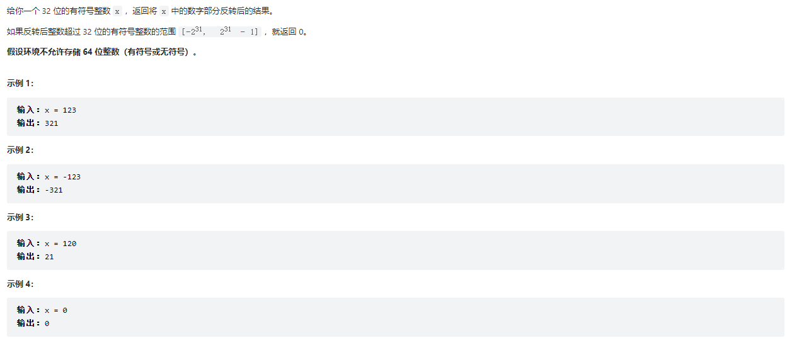

#### 7.整数反转



**我的题解**：

```java
class Solution {
    public int reverse(int x) {
         int rs=0;
        while(x!=0)
        {

            if(Integer.MIN_VALUE/10>rs||rs>Integer.MAX_VALUE/10)
            {
                return 0;
            }else if(rs==Integer.MIN_VALUE/10||rs==Integer.MAX_VALUE/10)
            {
               if(x%10<-8||x%10>7)
               {
                   return 0;
               }
            }
            rs=rs*10+x%10;
            x=x/10;
        }
        
        return rs<-2147483648||rs>2147483647?0:rs;
    }
}
```

**思路**：

如果仅仅是整数的反转是很简单的

1. x对10求余，得到x的个位y，x=x/10
2. 用rs=10*rs+y把结果累加，回到第一步，直到x=0

这道题目特殊的地方在于要使用int变量编程，这会遇到一个问题，不能存储超过int范围的数，而且在转化结果超出int范围时返回0，难点在于我们不能在得到转化结果之后再对比范围，因为如果溢出，结果已经是没有意义的错误数了，所以必须再得到下一步结果之前先判断所得结果会不会溢出。每一步结果都是`rs=rs*10+y`，所以要保证`rs * 10` 不溢出，而且还有个细节，`rs*10`是关于int的运算，结果溢出也会出错。所以必须用`Integer.MAX_VALUE/10>rs`的方法验证，如果`rs * 10` 刚好不溢出，再判断加上各位 y 后会不会溢出。


