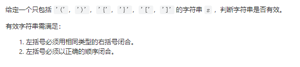
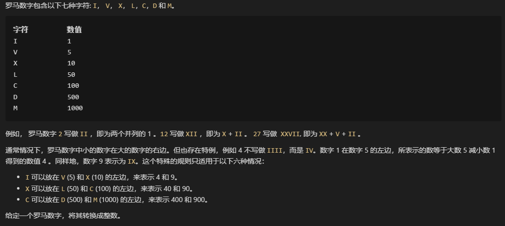
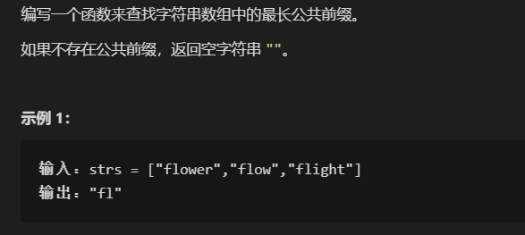
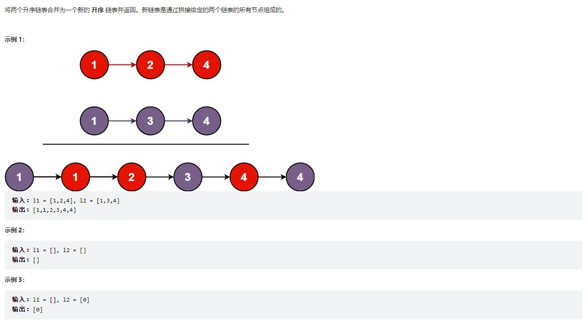
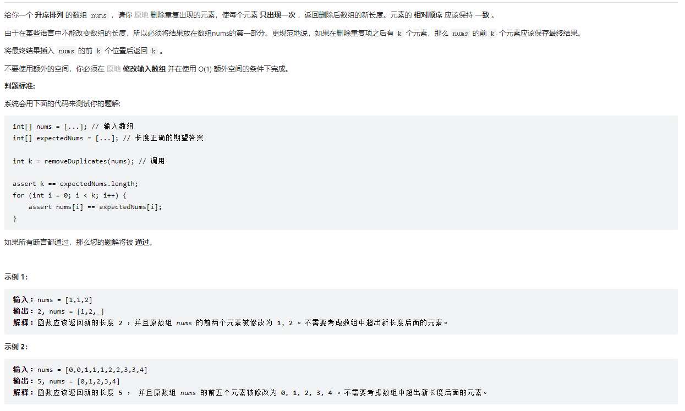
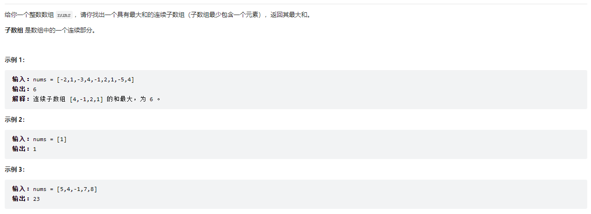
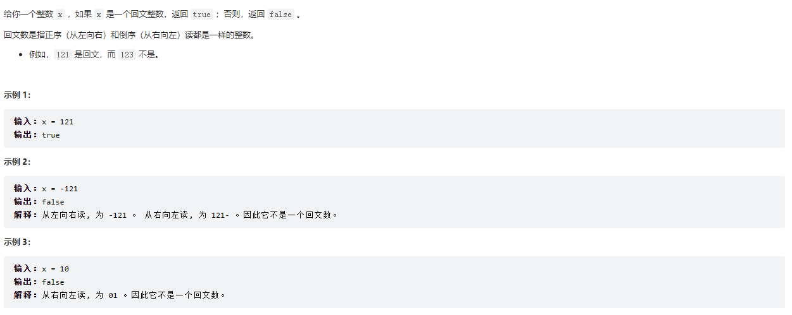

#### 1


#### 20. 有效的括号



**题解一**：

```java
class Solution {
       public boolean isValid(String s) {
        Stack<Character> stack=new Stack<>();
        for (int i=0;i<s.length();i++)
        {
            char c=s.charAt(i);
            if (c=='[')
                stack.push(']');
            else if (c=='{')
                stack.push('}');
            else if (c=='(')
                stack.push(')');
            else if (stack.isEmpty()||stack.peek()!=c)
                return false;
            else stack.pop();
        }
        return stack.isEmpty();
    }
}
```

小结：

主要思路就是栈的使用，栈的使用可以很容易解决括号的配对行为和顺序关系。Stack继承自Vector，在Vector上的各种操作因为加了synchronized关键字，速度比不上ArrayList和数组。


**题解二(优化内存)**：

```java
class Solution {
     public boolean isValid(String s) {
         try{
            if(s.length()%2!=0)
            return false;
            char c[] = new char[s.length()/2];
            int top=-1;
            for (int i=0; i<s.length();i++)
            {
                if(s.charAt(i)=='[')
                    c[++top]=']';
                else if(s.charAt(i)=='{')
                    c[++top]='}';
                else if (s.charAt(i)=='(')
                    c[++top]=')';
                else if (top==-1||s.charAt(i)!=c[top])
                    return false;
                else 
                    top--;
            }
            return top==-1;
         }catch (Exception e)
         {
             return false;
         }
        }

    }
```

小结：

题解一的解法使用的Stack是无法指定大小的，Vector每次扩容都会大容量增大为原来的两倍，这无疑会浪费内存。在括号匹配中，如果在超过一半的“左边”入栈都还没找到匹配的“右边”时，匹配一定失败，所以栈的大小只需要是括号字符串的一半大小。


#### 344.反转字符串


本来这是一道很简单的题目，不打算记录的，但是看到了别人的一个题解是我没有想到过的，所以还是记录了。

**题解一**

```java
class Solution {
    public void reverseString(char[] s) {
         char c;
        for(int i=0;i<s.length/2;i++)
        {
            c=s[i];
            s[i]=s[s.length-1-i];
            s[s.length-1-i]=c;
        }
    }
}
```


**题解二**

```java
class Solution {
    public void reverseString(char[] s) {
        for(int i=0;i<s.length/2;i++)
        {
           s[i]^=s[s.length-1-i];
           s[s.length-1-i]^=s[i];
           s[i]^=s[s.length-1-i];
        }
    }

}
```

这个题解用异或的方式实现了元素的互换，这种元素互换的方式是我没有想到的。但是在没有重载运算符的情况下，只有基本类型可以使用异或互换元素，毕竟基本类型都是数值类的。


#### 13.罗马数字转整型



**题解一**：

```java
class Solution {
    private int getValue(char c)
        {
            switch(c)
            {
                case 'I':
                return 1;
                case 'V':
                return 5;
                case 'X':
                return 10;
                case 'L':
                return 50;
                case 'C':
                return 100;
                 case 'D':
                return 500;
                 case 'M':
                return 1000;
            }
            return 0;
        }

    public int romanToInt(String s) {
        int sum=0;
        int c=0;
        for(int i=s.length()-1;i>=0;i--)
        {
           if(getValue(s.charAt(i))>=c)
           sum+=getValue(s.charAt(i));
           else
           sum-=getValue(s.charAt(i));
           c=getValue(s.charAt(i));
        }
    return sum;
    }
}
```

**小结**：

关键是遍历的顺序，从后往前遍历会比从前往后遍历方便一点。在题目保证输入完全正确的情况下这道题比较简单。


#### 14.最长公共前缀



**我的题解：**

```java
class Solution {
    public String longestCommonPrefix(String[] strs) {if(strs.length==0)
        return "";
        String trg=strs[0];
        int tmp=strs[0].length()-1;
        for(int i=1;i<strs.length;i++)
        {
            if(tmp>strs[i].length()-1)
            tmp=strs[i].length()-1;
            for(int j=tmp;j>=0;j--)
            {
                if(strs[i].charAt(j)!=trg.charAt(j))
                tmp=j-1;
            }
            if(tmp==-1)
            return "";
        }
        return trg.substring(0,tmp+1);
    }
}
```

**思路：**

其实就是暴力遍历每个字符串，蠢了。


**题解2**

```java
class Solution {
    public String longestCommonPrefix(String[] strs) {
        
        Arrays.sort(strs);
      int tmp=Math.min(strs[0].length(), strs[strs.length-1].length());
      for(int i=0;i<tmp;i++)
      {
          if(strs[0].charAt(i)!=strs[strs.length-1].charAt(i))
          {
              tmp=i;
              break;
          }
      }
      if(tmp<=0)
        return "";
      return strs[0].substring(0,tmp);
    }
}
```

**思路**：

先将原来的字符串数组按字典序排序，排序后的字符串数组的第一个字符串和最后一个字符串的公共前缀就是所有字符串的公共前缀。


**题解3**

```java
class Solution {
    public String longestCommonPrefix(String[] strs) {
        if(strs.length==0)return "";
        String s=strs[0];
        for (String string : strs) {
            while(!string.startsWith(s)){
                if(s.length()==0)return "";
                s=s.substring(0,s.length()-1);
            }
        }
        return s;
    }
}
```

使用了startsWith方法，在时间效率上较为出色。从头遍历字符串数组，用第一个字符串作为初始值，对于每个字符串元素，判断是否以s开始，如果不是，则把s的长度减一再对比，直到对比出公共前缀。


#### 21.合并两个有序链表




**我的题解**：

```java
/**
 * Definition for singly-linked list.
 * public class ListNode {
 *     int val;
 *     ListNode next;
 *     ListNode() {}
 *     ListNode(int val) { this.val = val; }
 *     ListNode(int val, ListNode next) { this.val = val; this.next = next; }
 * }
 */
class Solution {
    public ListNode mergeTwoLists(ListNode list1, ListNode list2) {
        if(list1==null||list2==null)
            return list1!=null?list1:list2!=null?list2:null;
            ListNode ln[]={list1,list2};
            int x=ln[0].val<=ln[1].val?0:1;
            ListNode head=ln[x],tmp=ln[x];
            while(ln[1-x]!=null)
            {
                while(ln[x].val<=ln[1-x].val)
                {
                    tmp=ln[x];
                    if(ln[x].next!=null)
                    ln[x]=ln[x].next;
                    else
                    {
                     ln[x]=null;
                    break;
                    }
                
                }
                tmp.next=ln[1-x];
                x=1-x;
            }
            return head;
    }
}
```

**思路**

首先拿到两个链表，先把head和tail指向开始数值小的那个链表，我将这个链表称为获得了遍历的机会，这个链表一直用头节点与另外一个链表的头节点对比，当这个链表的头节点小于另外一个链表的头节点时，这个链表通过`list=list.next`向后推进，当然在推进前需要`tail=list`先把目标链表的尾部记录，直到这个链表遍历到结尾或者遇到一个头节点大于另外链表的头节点，如果是前一种情况，则遍历结束因为一个链表的最大值小于另外链表的头节点，只要把记录的尾部tail接到另外那个链表的头部就结束了；如果是后面那种情况，则需要把遍历的机会转交，知道有一个链表遍历要结尾。

这里涉及链表的指代，我们在一开始只能设定在某个链表，而这个“某个链表”必须是头节点小的那个链表（如果相同，则指定第一个）开始，这种指代在代码中如何实现？我们可以把两个链表引用放到数组里，索引分别为0，1。知道索引为x，1-x就是另外那个链表引用的索引了。

**题解二：**

```java
/**
 * Definition for singly-linked list.
 * public class ListNode {
 *     int val;
 *     ListNode next;
 *     ListNode() {}
 *     ListNode(int val) { this.val = val; }
 *     ListNode(int val, ListNode next) { this.val = val; this.next = next; }
 * }
 */
class Solution {
    public ListNode mergeTwoLists(ListNode list1, ListNode list2) {
        if (list1 == null) return list2;
        if (list2 == null) return list1;
        ListNode res = list1.val < list2.val ? list1 : list2; //找到头节点小的那个链表，
        res.next = mergeTwoLists(res.next, list1.val >= list2.val ? list1 : list2);//
        return res;
    }
}
```

**思路：**

看到一个我完全想不到的做法，思路基本一致，但是使用了递归，代码也十分简洁优美，直接看代码吧。


------


#### 2


#### 26.删除有序数组中的重复项



**我的题解：**

```java
class Solution {
    public int removeDuplicates(int[] nums) {
        if(nums.length<=1)
        return nums.length;
        int front=0;
        for(int i=1;i<nums.length;i++)
        {
            if(nums[i]!=nums[front])
            {
                
                nums[front+1]=nums[i];
                front++;
                   
            }
        }
        return front+1;
    }
}
```

**思路：**

就地算法，在这道题里不可以使用额外的数组，思路就是把数组分为三部分，首先是目标数组部分、冗余数据部分、未遍历部分。目标数组部分的长度就是目前发现的不重复数组长度，冗余数据长度就是已发现的重复部分数据长度，这三个长度相加就是数组长度。只要用front标记到目标数组部分的最后位置，在遍历时，因为数组升序，每个元素只要与目标数组部分最后一个元素对比就可得知该元素是否为冗余数据，如果不等（不为冗余），则该数据加入到目标数组部分front+1的位置，如果相等则继续遍历。


#### 53.最大子序和



**我的题解：**

```java
class Solution {
    public int maxSubArray(int[] nums) {
       int sum=nums[0];
        int maxsum=sum;//题目表示数组非空，所以可以用数组第一个元素作为sum和maxsum的初始值，sum用来存储暂时和，maxsum用来存储最大和
        for(int i=1;i<nums.length;i++)
        {
            if(nums[i]<0)//当遍历到一个元素小于0，无论如何“暂时和”sum加上这个元素都会小于原来的值，所以先把sum与maxsum对比更新maxsum和释放sum
            {
                maxsum=sum>maxsum?sum:maxsum;
            }
            sum=sum<0?nums[i]:sum+nums[i];//sum<0时，sum不会去累加，所以sum直接更新为遍历到的值，表示新的“暂时和”重新累加；如果sum>=0就继续累加
        }
        return sum>maxsum?sum:maxsum;
    }
}
```

**思路：**

这个题解是O(n)的时间复杂度。


**官方题解(动规)**

```java
class Solution {
    public int maxSubArray(int[] nums) {
        int pre = 0, maxAns = nums[0];
        for (int x : nums) {
            pre = Math.max(pre + x, x);
            maxAns = Math.max(maxAns, pre);
        }
        return maxAns;
    }
}
```

**思路**

思路基本上和上面的一致，但是官方的解答显然更加简介有效。


**管方解答(分治法)**

```java
class Solution {
    public class Status {
        public int lSum, rSum, mSum, iSum;

        public Status(int lSum, int rSum, int mSum, int iSum) {
            this.lSum = lSum;//从区间左端点开始的最大子段和
            this.rSum = rSum;//从右端点往左的最大子段和
            this.mSum = mSum;//整个区间的最大子段和
            this.iSum = iSum;//表示整个区间求和
        }
    }

    public int maxSubArray(int[] nums) {
        return getInfo(nums, 0, nums.length - 1).mSum;
    }

    public Status getInfo(int[] a, int l, int r) {
        if (l == r) {
            return new Status(a[l], a[l], a[l], a[l]);//如果区间只有一个元素，则全部sum都是该元素
        }
        int m = (l + r) >> 1;//找区间中点
        Status lSub = getInfo(a, l, m);
        Status rSub = getInfo(a, m + 1, r);//递归左右分治，直到每个区间只剩一个元素
        return pushUp(lSub, rSub);//从单元素区间开始man
    }

    public Status pushUp(Status l, Status r) {//给两个区间，找出两个区间合并后的四个sum属性
        int iSum = l.iSum + r.iSum;
        int lSum = Math.max(l.lSum, l.iSum + r.lSum);
        int rSum = Math.max(r.rSum, r.iSum + l.rSum);
        int mSum = Math.max(Math.max(l.mSum, r.mSum), l.rSum + r.lSum);
        return new Status(lSum, rSum, mSum, iSum);
    }
}
```


#### 9.回文数



 **我的题解：**

```java
class Solution {
    public boolean isPalindrome(int x) {
        int re=x;
        int rs=0;
        while(x!=0)
        {
            rs=rs*10+x%10;
            x=x/10;
        }

        return re<0?false:rs==re;
    }
}
```

**思路：**

就是把整数反转后与原数对比，负数反转后必然不会与原数相同，而整数反转在前面的整数反转做过。
