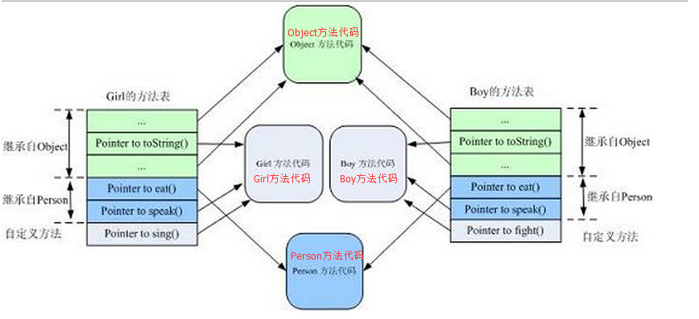

### 什么是多态

多态是面向对象的三大特性之一。多态是同一个行为具有多个不同表现形式或形态的能力。多态就是同一个接口，使用不同的实例而执行不同操作，具体操作有实例决定。

> 三大特性：封装、继承、多态

#### 多态的优点

-  **消除类型之间的耦合关系**
-  **可替换性**
- **可扩充性**
- **接口性**
- **灵活性**
- **简化性**

#### 多态存在的三个必要条件

- **继承(也可以是接口的实现)**

- **重写**

- **父类引用指向子类对象**

  > 比如 `Person person = new  Student();`Student是Person的父类。在实现多态时，主要体现在方法调用上，person可以调用Person类的方法，这些方法都可以被子类覆盖，但不能调用Student中定义但是Person类没有定义的方法。如果要实现多态，即在person调用一个自身的方法在编译时并不会知道执行哪个子类实例重写的方法，而是在运行时真正实例化右边的对象时才动态绑定方法。


------


### Java方法调用过程

先看Java核心技术的解释：

> 1. 编译器查看对象的声明类型和方法名。编译器将会一一列举该对象和其超类中所有名与该方法名相同且有权限访问的方法。
>
>    至此，编译器得到了可能被调用的候选方法。，，
>
> 2. 编译器确定方法调用中提供的参数类型，在前面的候选方法中选出参数类型匹配的方法。这个过程称为**重载解析**。
>
>    至此，编译器已经知道需要调用的方法的名字和参数列表，换言之，编译器知道了方法的**签名**。
>
> 3. 如果调用的方法是private，static，final方法或者是构造器，那么编译器可以准确地知道调用的是哪个方法，这称为**静态绑定**；如果调用地方法依赖于隐式参数的实际类型，那必须在运行时**动态绑定**。
>
> 4. 虚拟机预先为每个类计算了一个方法表，方法表中列出了该类所有方法的签名和要调用的方法。程序运行并采用动态绑定调用方法时，虚拟机会优先搜索实例的方法表。


#### 从JVM结构看多态：

##### JVM的结构：


##### **类型信息和class对象**

当程序运行需要某个类的定义时，**载入子系统 (class loader subsystem)** 装入所需的 class 文件，并在内部建立该类的**类型信息**，这个类型信息就存贮在方法区。类型信息一般包括该类的方法代码、类变量、成员变量的定义等等。可以说，类型信息就是类的 Java 文件在运行时的内部结构，包含了该类的所有在 Java 文件中定义的信息。

该类型信息和 class 对象是不同的。class 对象是 JVM 在载入某个类后于堆 (heap) 中创建的代表该类的对象，可以通过该 class 对象访问到该类型信息。比如最典型的应用，在 Java 反射中应用 class 对象访问到该类支持的所有方法，定义的成员变量等等。可以想象，JVM 在类型信息和 class 对象中维护着它们彼此的引用以便互相访问。两者的关系可以类比于进程对象与真正的进程之间的关系。

总体而言，当某个方法被调用时，JVM 首先要查找相应的**常量池**，得到方法的**符号引用**，并查找调用类的**方法表**以确定该方法的**直接引用**，最后才真正调用该方法。 


#### java的方法调用方式

Java的方法调用有两类，动态方法调用和静态方法调用。

静态方法调用是指对于类的静态方法的调用方式，是静态绑定的；而动态方法调用需要有方法调用所作用的对象，是动态绑定的。

JVM主要的调用指令有四个：

-  invokestatic
-  invokespecial
-  invokesvirtual 
-  invokeinterface

其中，两面两个是静态调用，后面两个是动态调用。


#### 常量池（constant pool）

常量池中保存的是一个 Java 类引用的一些常量信息，包含一些字符串常量及对于类的符号引用信息等。Java 代码编译生成的类文件中的常量池是**静态常量池**，当类被载入到虚拟机内部的时候，在内存中产生类的常量池叫**运行时常量池**。

常量池在逻辑上可以分成多个表，每个表包含一类的常量信息，重点看 对于 Java 调用相关的常量池表。

**CONSTANT_Utf8_info**

**字符串常量表**，该表包含该类所使用的所有字符串常量，比如代码中的字符串引用、引用的类名、方法的名字、其他引用的类与方法的字符串描述等等。其余常量池表中所涉及到的任何常量字符串都被索引至该表。


**CONSTANT_Class_info**

**类信息表**，包含任何被引用的类或接口的符号引用，每一个条目主要包含一个索引，指向 CONSTANT_Utf8_info 表，表示该类或接口的全限定名。


**CONSTANT_NameAndType_info**

**名字类型表**，包含引用的任意方法或字段的名称和描述符信息在字符串常量表中的索引。


**CONSTANT_InterfaceMethodref_info**

**接口方法引用表**，包含引用的任何接口方法的描述信息，主要包括类信息索引和名字类型索引。


**CONSTANT_Methodref_info**

**类方法引用表**，包含引用的任何类型方法的描述信息，主要包括类信息索引和名字类型索引。

> 
>
> 在这里对上面的几个的关系做简要的说明：
>
> 对于一个方法调用的字节码：
>
> ```xml
> 1: invokevirtual #2
> ```
>
> #2是常量池项，与**CONSTANT_InterfaceMethodref_info**对应，内容如下：
>
> ```text
> #2 = Methodref          #3.#17
> ```
>
> 可以看到，**CONSTANT_InterfaceMethodref_info**中有包含了两外两个表项 #3 #17，直接把能传递引用到的常量池项都找出来，会看到（按深度优先顺序排列）
>
> ```xml
> #2 = Methodref          #3.#17          
>    #3 = Class              #18             
>   #18 = Utf8               方法所在的类（Cass）
>   #17 = NameAndType        #13:#6           
>   #13 = Utf8               方法名(name)
>    #6 = Utf8               方法返回值类型(type)
> ```
>
>  上面：
>
> #17对应于**CONSTANT_NameAndType_info**
>
> #3对应于**CONSTANT_Class_info**
>
> #18、#13、#6都对应于**CONSTANT_Utf8_info**
>
> 而CONSTANT_Utf8_info对应的内容是一串特殊的字符串。
>
> 再看回`#2 = Methodref` 这句，Methodref的数据结构如下：
> ```java
> CONSTANT_Methodref_info {
> 
>    u1 tag;
> 
>    u2 class_index; //
> 
>    u2 name_and_type_index;
> 
> }
> ```
>
> 在经过上面的层次引用，知道找到最底下的CONSTANT_Utf8_info时，由于CONSTANT_Utf8_info记录的信息可以精准定位到某个类的某个方法，比如#18、#13、#6的组合，通过#3可以找到类中的方法表，通过#13、#6其实就是知道了方法的签名，至此，就可以返回该方法的代码位置（当然，返回代码的位置这一过程与下面所说的方法调用动态绑定相关），以上的步骤就是符号引用转为直接引用的过程。


#### 方法表与方法调用

> 方法表是在常量池中的，程序是如何找到方法表的，参照上面。

方法表是动态调用的核心，也是 Java 实现动态调用的主要方式。它被存储于方法区中的类型信息，包含有该类型所定义的所有方法及指向这些方法代码的指针，注意这些具体的方法代码可能是被覆写的方法，也可能是继承自基类的方法

方法表通过方法的签名可对应方法来定位到一个方法：

```java
class Person { 
 public String toString(){ 
    return "I'm a person."; 
	 } 
 public void eat(){} 
 public void speak(){} 
	
 } 
 
 class Boy extends Person{ 
 public String toString(){ 
    return "I'm a boy"; 
	 } 
 public void speak(){} 
 public void fight(){} 
 } 
 
 class Girl extends Person{ 
 public String toString(){ 
    return "I'm a girl"; 
	 } 
 public void speak(){} 
 public void sing(){} 
 }
```

当这三个类被载入到 Java 虚拟机之后，方法区中就包含了各自的类的信息。Girl 和 Boy 在方法区中的方法表可表示如下：



可以看到，在类的继承中父类的方法与子类继承而来的方法在方法表中的偏移量是一致的，这么做有何意义，看下面的例子：

从上图可以清楚地看到调用方法的指针指向。而且可以看出相同签名的方法在方法表中的偏移量是一样的。这个偏移量只是说Boy方法表中的继承自Object类的方法、继承自Person类的方法的偏移量与Person类中的相同方法的偏移量是一样的，与Girl是没有任何关系的。

下面再看看调用过程，以`girl.speak()` 方法的调用为例。在我的字节码中，假设调用方法的字节码为：`invokevirtual #12`; 。调用过程图如下所示：


1. 在常量池中找到方法调用的**符号引用**
2. 查看Person的**方法表**，得到speak方法在该方法表的偏移量（假设为15），这样就得到该方法的直接引用。
3. 根据**this指针**确定方法接收者(girl)的实际类型
4. 根据对象的实际类型得到该实际类型对应的方法表，根据偏移量15查看有无重写（override）该方法，如果重写，则可以直接调用；如果没有重写，则需要拿到按照继承关系从下往上的基类（这里是Person类）的方法表，同样按照这个偏移量15查看有无该方法。


#### 接口调用

因为 Java 类是可以同时实现多个接口的，而当用接口引用调用某个方法的时候，情况就有所不同了。

Java 允许一个类实现多个接口，从某种意义上来说相当于多继承，这样同样的方法在基类和派生类的方法表的位置就可能不一样了。

```java
interface IDance{ 
   void dance(); 
 } 
 


 class Person { 
 public void eat(){} 
 public void speak(){} 
	
 } 
 


 class Dancer extends Person implements IDance {
     
 public void dance(){} 
 } 
 


 class Snake implements IDance{ 
 public void dance(){ 
 //snake dance 
	 } 
 }

```

​	


从上图可以看到IDance接口中的方法dance(）在Dancer类的方法表中的偏移量跟在Snake类的方法表中的偏移量是不一样的，因此无法仅根据偏移量来进行方法的调用。（这句话在理解时，要注意，只是为了强调invokeinterface在查找方法时不再是基于偏移量来实现的，而是**基于搜索**的方式。）应该这么说，dance方法在IDance方法表（如果有的话）中的偏移量与在Dancer方法表中的偏移量是不一样的。
**因此，要在Dancer的方法表中找到dance方法，必须搜索Dancer的整个方法表。**

因为每次接口调用都要搜索方法表，所以从效率上来说，接口方法的调用总是慢于类方法的调用的。


### 参考链接

https://github.com/h2pl/Java-Tutorial/blob/master/docs/java/basic/23%E3%80%81%E7%BB%A7%E6%89%BF%E3%80%81%E5%B0%81%E8%A3%85%E3%80%81%E5%A4%9A%E6%80%81%E7%9A%84%E5%AE%9E%E7%8E%B0%E5%8E%9F%E7%90%86.md#%E7%BB%A7%E6%89%BF%E7%9A%84%E5%AE%9E%E7%8E%B0%E5%8E%9F%E7%90%86

(https://blog.csdn.net/zmh458/article/details/101075633)