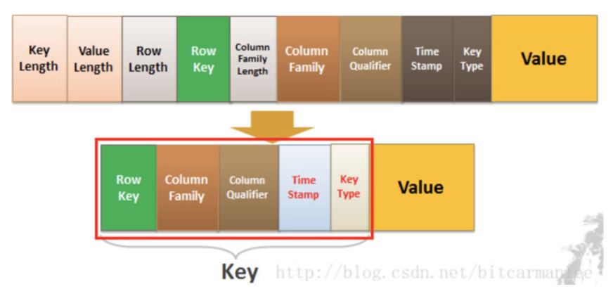
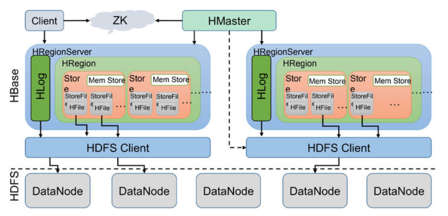
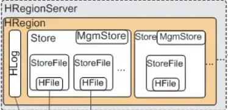
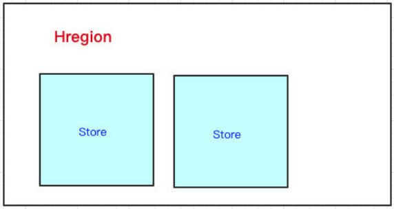
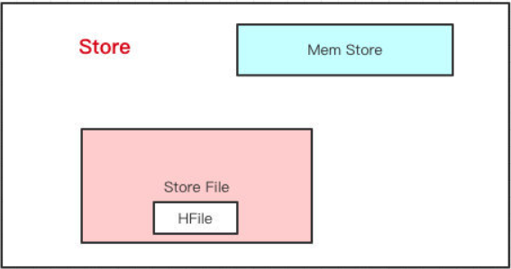
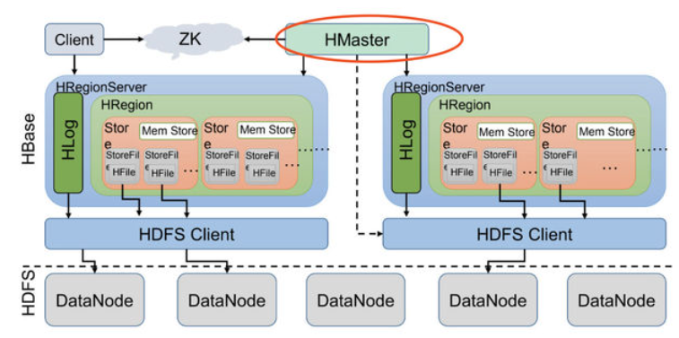

> [Apache](https://link.zhihu.com/?target=https%3A//www.apache.org/) HBase™ is the [Hadoop](https://link.zhihu.com/?target=https%3A//hadoop.apache.org/) database, a distributed, scalable, big data store.
> HBase is a type of "NoSQL" database.

Apache HBase 是 Hadoop 数据库，一个分布式、可伸缩的大数据存储。HBase所用的文件系统时HDFS，所以HBase可以存储大量的数据。

#### 使用场景

#### 概念理解

##### 列式存储

在Mysql中我们存储数据是行为单位的，当我们建好一个表，表中每一行的大小就固定下来了：

| id   | uname | uage | ujob | uschool |
| ---- | ----- | ---- | ---- | ------- |
| 1    | 张三  | 19   |      | 大学    |
| 2    | 李四  | 25   | 搬砖 |         |

如上面的例子，在现实使用mysql时，我们有大量的数据也是不完全填满一行的，但是即使我们不再表中的这一行插入数据，但是数据库还是给我们预留了空间，这空间在这种情况下就白白浪费了。

说回列数存储，还是上面的数据，在列式存储下，是这样的：

| id   | key     | value |
| ---- | ------- | ----- |
| 1    | uname   | 张三  |
| 1    | uage    | 19    |
| 1    | ujob    | 大学  |
| 2    | uname   | 李四  |
| 2    | hage    | 25    |
| 2    | uschool | 搬砖  |

可以看到，在列示存储下，就不存在浪费空间这一说法了，所以说列式存储有利于充分利用存储空间。

那是不是说在HBase中，底层的存储方式就是上面的列式存储的形式呢？

是，但不完全是。在HBase中，更准确的说法是基于列族存储。

列族是什么，先看一个例子：

|        | uinfo     | uinfo    | uwork    | uwork       |
| ------ | --------- | -------- | -------- | ----------- |
| **id** | **uname** | **uage** | **ujob** | **uschool** |
| 1      | 张三      | 19       |          | 大学        |
| 2      | 李四      | 25       | 搬砖     |             |

在上面的表中uinfo和uwork就是列族，这里看起来就像mysql中各个表以id作为一个统一的主键拼接起来了。在HBase中，当然不是以这种形式存取的，不然的话岂不是又回到按行存储了吗。

在HBase中，上面的形式会变为：

​	

| RowKey | Columns-Family | Columns Qualifier(列标识) | Value |
| ------ | -------------- | ------------------------- | ----- |
| 1      | uinfo          | uname                     | 张三  |
| 1      | uinfo          | uage                      | 19    |
| 1      | uwork          | uschool                   | 大学  |
| 2      | uinfo          | uname                     | 李四  |
| 2      | uinfo          | uage                      | 25    |
| 2      | uwork          | ujob                      | 搬砖  |

当然上面的所有表都是为了理解HBase的存储方式，在实际上，Hbase的存储会稍微复杂一些。

##### HBase的Key-Value

HBase本质上就是`Key-Value`的数据库。

在HBase中Key的值由**RowKey**(行键)+**ColumnFamily**（列族）+**Column Qualifier**（列修饰符）+**TimeStamp**（时间戳--版本）+**KeyType**（类型）组成，而**Value**就是实际上的值。

##### HBase架构

- **Client**客户端：用来访问HBase的接口，维护了对应的cache来加速HBase的访问。
- **ZK(ZooKeeper)**：存储HBase的元数据（Mate表），Mate表存储的元数据指示客户端去那台机器读写数据。
- **HResgionServer**：处理客户端的读写请求，与底层HDFS交互。

大致的流程：Client请求到Zookeeper，然后Zookeeper返回HRegionServer地址给client，client得到Zookeeper返回的地址去请求HRegionServer，HRegionServer读写数据后返回给client。

##### HRegionServer

HBase可以存储海量的数据，因为HBase是分布式的，所以HBase中的一张表不会只存在一台机器上，HBase会根据Key-Row分割一张表，把Key-Row相同的部分数据放到同一个HRedion，也就是说，一个HRegion存放一部分表，一张完整的表分散在各台机器的各个节点中。

**HRegion：**HRegionServer的实例（节点），一个HRegionServer可以有多个HRegion。HRegion的结构如下：

可以看到，HRegion下面是Store，Store有什么用呢。

在经过上面的分解，一个表的一部分数据已经来到Hregion中，在这里还可以进行一次分割。如何分割？按照列族分割，把列族相同的数据放在一起，每个Store里面存放同一列族的数据。

**Store：**Store的结构如下：

HBase在写数据的时候，会先写到`Mem Store`，当`MemStore`超过一定阈值，就会将内存中的数据刷写到硬盘上，形成**StoreFile**，而`StoreFile`底层是以`HFile`的格式保存，`HFile`是HBase中`KeyValue`数据的存储格式。

> `Mem Store`我们可以理解为内存 buffer，`HFile`是HBase实际存储的数据格式，而`StoreFile`只是HBase里的一个名字。

**HLog：**在HRegionServer中，还有一个重要部分HLog。

我们写数据的时候是先写到内存的，为了防止机器宕机，内存的数据没刷到磁盘中就挂了。我们在写`Mem store`的时候还会写一份`HLog`。

这个`HLog`是顺序写到磁盘的，所以速度还是挺快的。

##### HMaster

> `HMaster` is the implementation of the Master Server. The Master server is responsible for monitoring all RegionServer instances in the cluster, and is the interface for all metadata changes.

**HMaster**会处理 HRegion 的分配或转移。如果我们HRegion的数据量太大的话，HMaster会对拆分后的Region**重新分配RegionServer**。（如果发现失效的HRegion，也会将失效的HRegion分配到正常的HRegionServer中）

HMaster会处理元数据的变更和监控RegionServer的状态。

#### 查询方式设计

在HBase里边提供了三种的查询方式：

1. 全局扫描
2. 根据一个RowKey进行查询
3. 根据RowKey过滤的范围查询

##### 根据一个RowKey查询

RowKey是会按**字典序**排序的，我们HBase表会用RowKey来横向切分表。无论是读和写我们都是用RowKey去定位到HRegion，然后找到HRegionServer。

**怎么知道这个RowKey是在哪个HRegion上的**？

我们在定位HRegionServer的时候，通过定位我们这个RowKey在不在这个HRegion的`start-key`和`end-key`范围之内，如果在，就找到了。

现在存在一个问题，就是如果在某个`start-key`和`end-key`的数据是热点数据，经常被访问到，但是这些数据有存放在同一个HRegion上，这就会造成某个HRegion特别繁忙，而其他HRegion空闲的情况。

这时候，我们需要对热点数据的Key-Row进行散列，把这些数据分开。

##### 根据RowKey范围查询

HBase将RowKey设计为字典序排序，如果不做限制，那很可能类似的RowKey存储在同一个HRegion中。根据范围查询时，可能在在同一个HRegion就可以拿到想要的数据了。
