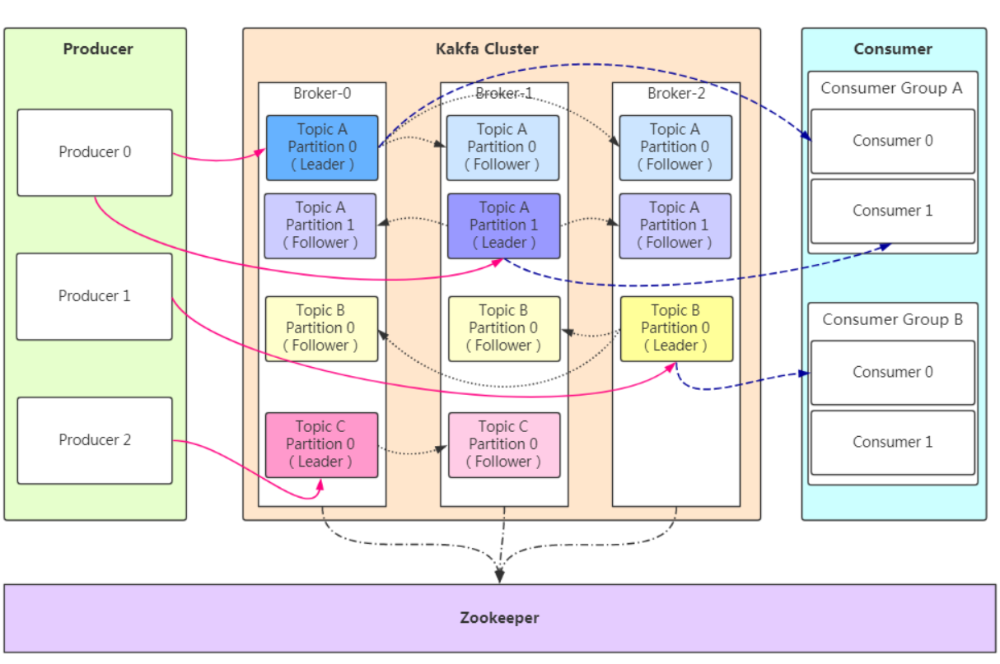
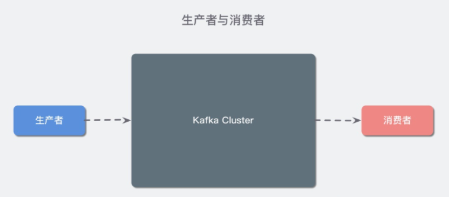
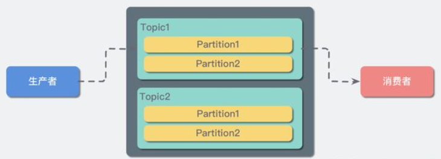
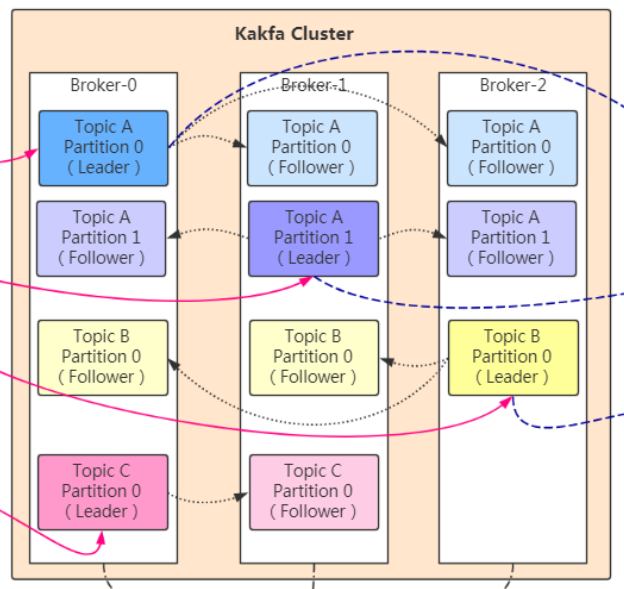
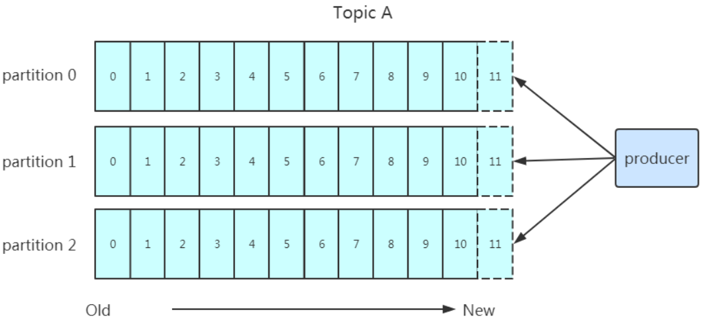
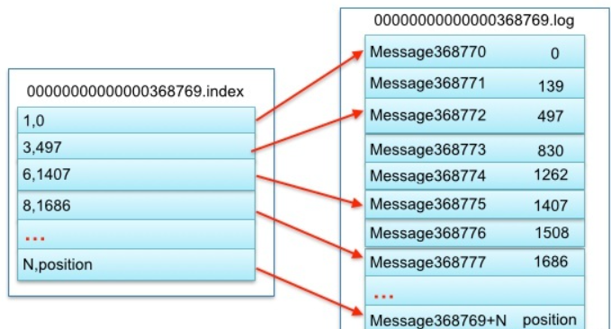

**Kafka** 是一种分布式的，基于**发布 / 订阅**的消息系统。

主要设计目标如下：

- 以时间复杂度为 O(1) 的方式提供消息持久化能力，即使对 TB 级以上数据也能保证常数时间复杂度的访问性能。
- 高吞吐率。即使在非常廉价的商用机器上也能做到单机支持每秒 100K 条以上消息的传输。
- 支持 Kafka Server 间的消息分区，及分布式消费，同时保证每个 Partition 内的消息顺序传输。
- 同时支持离线数据处理和实时数据处理。
- Scale out：支持在线水平扩展。

### 概念理解



#### 生产者与消费者：



对于 Kafka 来说客户端有两种基本类型：**生产者（Producer）**和**消费者（Consumer）**。除此之外，还有用来做数据集成的 Kafka Connect API 和流式处理的 Kafka Streams 等高阶客户端，但这些高阶客户端底层仍然是生产者和消费者API，它们只不过是在上层做了封装。

生产者创建消息，消费者消费/读取消息。


------


#### Topic与Partition



Topic是主题，Partition是分区，一个Topic内通常有多个分区。

在kafka中，消息以主题分类，kafka的主题类似mysql的表，每个主题对应一个消息队列，同一种类型的消息被存放在同一主题中。但是如果同一种主题的消息全部堆放于一个消息队列，势必会造成拥挤。所以Kafka把每个Topic分为多个Partition来对Topic进行水平拓展。


------


#### **Broker 和集群（Cluster）**



一个 Kafka 服务器也称为 Broker，它接受生产者发送的消息并存入磁盘；同时Broker 服务消费者拉取分区消息的请求，返回目前已经提交的消息。使用特定的机器硬件，一个 Broker 每秒可以处理成千上万的分区和百万量级的消息。

若干个 Broker 组成一个集群（Cluster），其中集群内某个 Broker 会成为集群控制器（Cluster Controller），它负责管理集群，包括分配分区到 Broker、监控 Broker 故障等。在集群内，一个分区由一个 Broker 负责，这个 Broker 也称为这个分区的 Leader；当然一个分区可以被复制到多个 Broker 上来实现冗余，这样当存在 Broker 故障时可以将其分区重新分配到其他 Broker 来负责。


### 数据存储

**Kafka 的消息是存在于文件系统之上的**。Kafka的数据存储在磁盘上，很多人认为磁盘的读写速度很慢，明显与Kafka百万级别的吞吐量不匹配。但是事实上磁盘读写地快慢是由条件地，磁盘在处理多个小文件读写会很慢，但是处理一个大文件就会很快。所以可以对磁盘写入做**后写**优化即将将很多小的逻辑写操作合并起来组合成一个大的物理写操作来优化写入速度；通过**预读**即提前将一个比较大的磁盘快读入内存来进行读取优化，还有很多其他优化......

#### Partition

Topic是**逻辑上的概念**，直接面向消费者和生成者。Kafka在面向内存的是**Partition**，每一个 Partition 最终对应一个目录，里面存储所有的消息和索引文件。默认情况下，每一个 Topic 在创建时如果不指定 Partition 数量时只会创建 1 个 Partition。



任何发布到 Partition 的消息都会被追加到 Partition 数据文件的尾部，这样的顺序写磁盘操作让 Kafka 的效率非常高（经验证，顺序写磁盘效率比随机写内存还要高，这是 Kafka 高吞吐率的一个很重要的保证）。

每一条消息被发送到 Broker 中，会根据 Partition 规则选择被存储到哪一个 Partition。如果 Partition 规则设置的合理，所有消息可以均匀分布到不同的 Partition中。


#### **底层存储设计**

假设我们现在 Kafka 集群只有一个 Broker，我们创建 2 个 Topic 名称分别为：「topic1」和「topic2」，Partition 数量分别为 1、2，那么我们的根目录下就会创建如下三个文件夹：

```text
  | --topic1-0
  | --topic2-0
  | --topic2-1
```

在 Kafka 的文件存储中，同一个 Topic 下有多个不同的 Partition，每个 Partition 都为一个目录，而每一个目录又被平均分配成多个大小相等的 **Segment File** 中，Segment File 又由 index file 和 data file 组成，他们总是成对出现，后缀 ".index" 和 ".log" 分表表示 Segment 索引文件和数据文件。

现在假设我们设置每个 Segment 大小为 500 MB，并启动生产者向 topic1 中写入大量数据，topic1-0 文件夹中就会产生类似如下的一些文件：

```text
    | --topic1-0
        | --00000000000000000000.index
        | --00000000000000000000.log
        | --00000000000000368769.index
        | --00000000000000368769.log
        | --00000000000000737337.index
        | --00000000000000737337.log
        | --00000000000001105814.index
        | --00000000000001105814.log
    | --topic2-0
    | --topic2-1
```

**Segment 是 Kafka 文件存储的最小单位。**Segment 文件命名规则：Partition 全局的第一个 Segment 从 0 开始，后续每个 Segment 文件名为上一个 Segment 文件最后一条消息的 offset 值。数值最大为 64 位 long 大小，19 位数字字符长度，没有数字用0填充。如 00000000000000368769.index 和 00000000000000368769.log。

以上面的一对 Segment File 为例，说明一下索引文件和数据文件对应关系：



其中以索引文件中元数据 `<3, 497>` 为例，依次在数据文件中表示第 3 个 message（在全局 Partition 表示第 368769 + 3 = 368772 个 message）以及该消息的物理偏移地址为 497。

注意该 index 文件并不是从0开始，也不是每次递增1的，这是因为 Kafka 采取稀疏索引存储的方式，每隔一定字节的数据建立一条索引，它减少了索引文件大小，使得能够把 index 映射到内存，降低了查询时的磁盘 IO 开销，同时也并没有给查询带来太多的时间消耗。

因为其文件名为上一个 Segment 最后一条消息的 offset ，所以当需要查找一个指定 offset 的 message 时，通过在所有 segment 的文件名中进行二分查找就能找到它归属的 segment ，再在其 index 文件中找到其对应到文件上的物理位置，就能拿出该 message 。

由于消息在 Partition 的 Segment 数据文件中是顺序读写的，且消息消费后不会删除（删除策略是针对过期的 Segment 文件），这种顺序磁盘 IO 存储设计师 Kafka 高性能很重要的原因。

> Kafka 是如何准确的知道 message 的偏移的呢？这是因为在 Kafka 定义了标准的数据存储结构，在 Partition 中的每一条 message 都包含了以下三个属性：

- offset：表示 message 在当前 Partition 中的偏移量，是一个逻辑上的值，唯一确定了 Partition 中的一条 message，可以简单的认为是一个 id；
- MessageSize：表示 message 内容 data 的大小；
- data：message 的具体内容


### 参考链接

[](https://zhuanlan.zhihu.com/p/74063251)