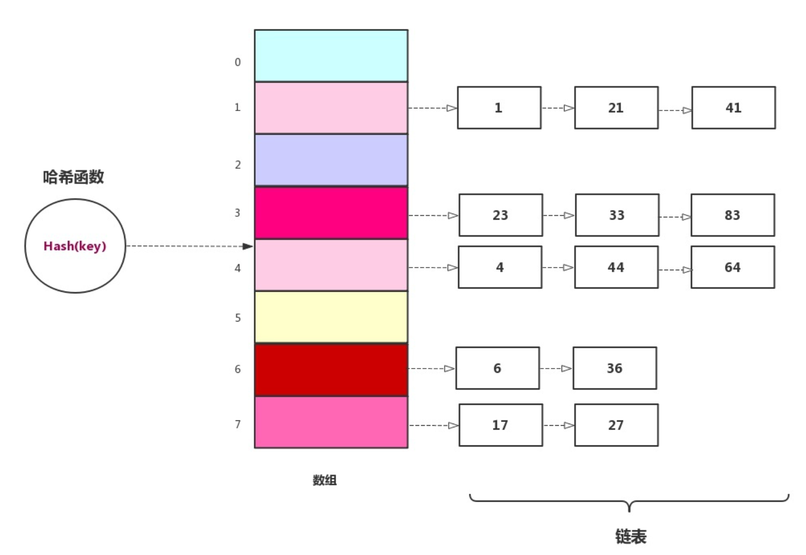

**哈希表**也叫**散列表**，哈希表是一种数据结构，它提供了快速的插入操作和查找操作，无论哈希表总中有多少条数据，插入和查找的时间复杂度都是为**O(1)**。

哈希表是**基于数组**的，我们知道数组创建后扩容成本比较高，所以当哈希表被填满时，性能下降的比较严重。


## 哈希函数

哈希函数的作用是帮我们把非int的**「键」**或者**「关键字」**转化成int，可以用来做数组的下标。比如将学生的姓名作为**「键」**或者**「关键字」**，这是就需要哈希函数来完成。

哈希函数的写法有很多中，来看看**HashMap**中的哈希函数 **(In Java 8)**：

```java
static final int hash(Object key) {
        int h;
        return (key == null) ? 0 : (h = key.hashCode()) ^ (h >>> 16);//h(哈希值)高16位与低16位的异或，int是32位
    }
```

在这里`hashCode()`是Object类中定义的本地方法，使用JVM提供的默认方法生成hashcode。

无论`hashCode()`在底层以什么方式实现，都应该满足以条件：

- 如果 key1 = key2，那 hash(key1) == hash(key2)；
- 如果 key1 ≠ key2，那 hash(key1) 大概率不等于 hash(key2)；

对于第二点，如果发生了key1 ≠ key2，但是hash(key1) == hash(key2)的情况，称为发生了**哈希冲突**


## 哈希冲突

哈希冲突是不可避免的，因为一个输入经过哈希后输出的哈希值是定长的，例如输出32位hash值，一共有2^32种可能，但是输入是不限制长度的，可以说输入有无限种可能。

常用解决哈希冲突的方法有两种**开放地址法**和**链表法**。


### 开放地址法

在开放地址法中，若数据不能直接存放在哈希函数计算出来的数组下标时，就需要寻找其它位置来存放。在开放地址法中有三种方式来寻找其他的位置，分别是 **线性探测**、**二次探测**、**再哈希法**。


#### 1. 线性探测法

##### **线性探测的插入**

在线性探测哈希表中，数据的插入是线性的查找空白单元，例如，我们将数88经过哈希函数后得到的数组下标是16，但是在数组下标为16的地方已经存在元素，那么就找17,17还存在元素就找18，一直往下找，直到找到空白地方存放元素。

代码实现：

```java
/**
 * 哈希函数
 * @param key
 * @return
 */
private int hash(int key) {
    return (key % size);
}
/**
 * 插入
 * @param student
 */
public void insert(Student student)
{
    int key = student.getKey();
    int hashVal = hash(key);
    while (array[hashVal] !=null && array[hashVal].getKey() !=-1){
        ++hashVal;
        // 如果超过数组大小，则从第一个开始找
        hashVal %=size;
    }
    array[hashVal] = student;
}
```


##### 线性探测的查找

线性探测哈希表的查找过程类似与插入过程。通过散列函数求出要查找元素的键值对应的散列值，然后比较数组中下标为散列值的元素和要查找的元素。如果相等，则说明就是我们要找的元素；否则就顺序往后依次查找。如果遍历到数组中的空闲位置，还没有找到，就说明要查找的元素并没有在哈希表中。

代码实现：

```java
/**
 * 查找
 * @param key
 * @return
 */
public Student find(int key){
    int hashVal = hash(key);
    while (array[hashVal] !=null){
        if (array[hashVal].getKey() == key){
            return array[hashVal];
        }
        ++hashVal;
        hashVal %=size;
    }

    return null;
}
```


##### 线性探测的删除

线性探测哈希表的删除相对来说比较复杂一点，不能简单的把这一项数据删除，让它变成空，因为在线性探测下的查找在遇到第一个null值时会停下，如果这个null值是我们的删除操作导致的，这会导致后面可能存在的目标值不被找到。

因此需要使用一个特殊的数据来顶替这个被删除的数据。但是如果在线性探测哈希表中做了多次操作，会导致哈希表中充满这个特殊数据项，使的哈希表的效率下降，所以很多哈希表中没有提供删除操作，即使提供了删除操作的，也尽量少使用删除函数。


------


#### 2. 二次探测

在线性探测哈希表中，数据会发生聚集，一旦聚集形成，它就会变的越来越大，那些哈希函数后落在聚集范围内的数据项，都需要一步一步往后移动，并且插入到聚集的后面，因此聚集变的越大，聚集增长的越快。

二次探测是防止聚集产生的一种尝试，思想是探测相隔较远的单元，而不是和原始位置相邻的单元。在线性探测中，如果哈希函数得到的原始下标是x,线性探测就是x+1,x+2,x+3......，以此类推，而在二次探测中，探测过程是x+12,x+2^2,x+3^2,x+4^2,x+5^2......,以此类推


##### 二次探测存在的问题

二次探测消除了线性探测的聚集问题，这种聚集问题叫做**原始聚集**，然而，二次探测也产生了新的聚集问题，之所以会产生新的聚集问题，是因为所有映射到同一位置的关键字在寻找空位时，探测的位置都是一样的。

比如讲1、11、21、31、41依次插入到哈希表中，它们映射的位置都是1，那么11需要以一为步长探测，21需要以四为步长探测，31需要为九为步长探测，41需要以十六为步长探测，只要有一项映射到1的位置，就需要更长的步长来探测，这个现象叫做**二次聚集**。


------


#### 3. 双哈希

双哈希是为了消除原始聚集和二次聚集问题，不管是线性探测还是二次探测，每次的探测步长都是固定的。双哈希是除了第一个哈希函数外再增加一个哈希函数用来根据关键字生成探测步长，这样即使第一个哈希函数映射到了数组的同一下标，但是探测步长不一样，这样就能够解决聚集的问题。


双哈希的第二个哈希函数必须有以下**特点**：

- 和第一个哈希函数不一样
- 不能输出为0，因为步长为0，每次探测都是指向同一个位置，将进入死循环，经过试验得出`stepSize = constant-(key%constant);`形式的哈希函数效果非常好，`constant`是一个质数并且小于数组容量

双哈希的哈希表实现与线性探测差不多，就是把探测步长通过**「关键字」**来生成：


**添加第二个哈希函数**：

```java
/**
 * 根据关键字生成探测步长
 * @param key
 * @return
 */
private int stepHash(int key) {
    return 7 - (key % 7);
}
```


##### 双哈希的插入

```java
/**
 * 双哈希插入
 *
 * @param student
 */
public void insert(Student student) {
    int key = student.getKey();
    int hashVal = hash(key);
    // 获取步长
    int stepSize = stepHash(key);
    while (array[hashVal] != null && array[hashVal].getKey() != -1) {
        hashVal +=stepSize;
        // 如果超过数组大小，则从第一个开始找
        hashVal %= size;
    }
    array[hashVal] = student;
}
```


##### 双哈希的查找

```java
/**
 * 双哈希查找
 *
 * @param key
 * @return
 */
public Student find(int key) {
    int hashVal = hash(key);
    int stepSize = stepHash(key);
    while (array[hashVal] != null) {
        if (array[hashVal].getKey() == key) {
            return array[hashVal];
        }
        hashVal +=stepSize;
        hashVal %= size;
    }

    return null;
}
```


##### 双哈希的删除

```java
/**
 * 双哈希删除
 *
 * @param key
 * @return
 */
public Student delete(int key) {
    int hashVal = hash(key);
    int stepSize = stepHash(key);
    while (array[hashVal] != null) {
        if (array[hashVal].getKey() == key) {
            Student temp = array[hashVal];
            array[hashVal] = nodata;
            return temp;
        }
        hashVal +=stepSize;
        hashVal %= size;
    }
    return null;
}
```


##### **双哈希表的容量需要是一个质数**。

**为什么双哈希需要哈希表的容量是一个质数？**

假设我们哈希表的容量为15，某个**「关键字」**经过双哈希函数后得到的数组下标为0，步长为5。那么这个探测过程是0,5,10,0,5,10，一直只会尝试这三个位置，永远找不到空白位置来存放，最终会导致崩溃。

如果我们哈希表的大小为13，某个**「关键字」**经过双哈希函数后得到的数组下标为0，步长为5。那么这个探测过程是0,5,10,2,7,12,4,9,1,6,11,3。会查找到哈希表中的每一个位置。

使用开放地址法，不管使用那种策略都会有各种问题，所以开放地址法很少使用。在开放地址法中使用较多的是双哈希策略。


### 链表法

开放地址法中，通过在哈希表中再寻找一个空位解决冲突的问题，还有一种更加常用的办法是使用**链表法**来解决哈希冲突。**链表法**相对简单很多，**链表法**是每个数组项对应一条链表。当某项关键字通过哈希后落到哈希表中的某个位置，把该条数据添加到链表中，其他同样映射到这个位置的数据项也只需要添加到链表中，并不需要在原始数组中寻找空位来存储。



**链表法**解决哈希冲突代码比较简单，但是代码比较多，因为需要维护一个链表的操作，这里采用**有序链表**，有序链表不能加快成功的查找，但是可以减少不成功的查找时间，因为只要有一项比查找值大，就说明没有我们需要查找的值，删除时间跟查找时间一样，有序链表能够缩短删除时间。但是有序链表增加了插入时间，我们需要在有序链表中找到正确的插入位置。


##### **有序链表操作类**

```java
public class SortedLinkList {
    private Link first;
    public SortedLinkList(){
        first = null;
    }
    /**
     *链表插入
     * @param link
     */
    public void insert(Link link){
        int key = link.getKey();
        Link previous = null;
        Link current = first;
        while (current!=null && key >current.getKey()){
            previous = current;
            current = current.next;
        }
        if (previous == null)
            first = link;
        else
            previous.next = link;
        link.next = current;
    }

    /**
     * 链表删除
     * @param key
     */
    public void delete(int key){
        Link previous = null;
        Link current = first;
        while (current !=null && key !=current.getKey()){
            previous = current;
            current = current.next;
        }
        if (previous == null)
            first = first.next;
        else
            previous.next = current.next;
    }

    /**
     * 链表查找
     * @param key
     * @return
     */
    public Link find(int key){
        Link current = first;
        while (current !=null && current.getKey() <=key){
            if (current.getKey() == key){
                return current;
            }
            current = current.next;
        }
        return null;
    }
    public void displayList(){
        System.out.print("List (first-->last): ");
        Link current = first;
        while (current !=null){
            current.displayLink();
            current = current.next;
        }
        System.out.println(" ");
    }
}
```


##### **链表法哈希表插入**

在链表法中由于产生哈希冲突的元素都存放在链表中，所以链表法的插入非常简单，只需要在对应下标的链表中添加一个元素即可。

```java
/**
 * 链表法插入
 *
 * @param data
 */
public void insert(int data) {
    Link link = new Link(data);
    int key = link.getKey();
    int hashVal = hash(key);
    array[hashVal].insert(link);
}
```


##### **链表法哈希表查找**

```java
/**
 * 链表法-查找
 *
 * @param key
 * @return
 */
public Link find(int key) {
    int hashVal = hash(key);
    return array[hashVal].find(key);
}
```


##### **链表法哈希表查找**

```java
/**
 * 链表法-查找
 *
 * @param key
 * @return
 */
public Link find(int key) {
    int hashVal = hash(key);
    return array[hashVal].find(key);
}
```


### **开放地址法和链表法的比较**

如果使用**开放地址法**，对于小型的哈希表，双哈希法要比二次探测的效果好，如果内存充足并且哈希表一经创建，就不再修改其容量，在这种情况下，线性探测效果相对比较好，实现起来也比较简单，在装载因子低于0.5的情况下，基本没有什么性能下降。

如果在创建哈希表时，不知道未来存储的数据有多少，使用链表法要比开放地址法好，如果使用开放地址法，随着装载因子的变大，性能会直线下降。

当两者都可以选时，使用链表法，因为链表法对应不确定性更强，当数据超过预期时，性能不会直线下降。


------


## 哈希表的效率

在哈希表中执行插入和搜索操作都可以达到O(1)的时间复杂度，在没有哈希冲突的情况下，只需要使用一次哈希函数就可以插入一个新数据项或者查找到一个已经存在的数据项。

如果发生哈希冲突，插入和查找的时间跟探测长度成正比关系，探测长度取决于装载因子，装载因子是用来表示转载元素的多少。

装载因子的计算公式：

> 装载因子 = 表中已存的元素 / 表的长度

装载因子越大，说明空闲位置越少，冲突越多，散列表的性能会下降。


------


## 参考链接：

[图文并茂详解数据结构之哈希表 - 知乎 (zhihu.com)](https://zhuanlan.zhihu.com/p/144296454)